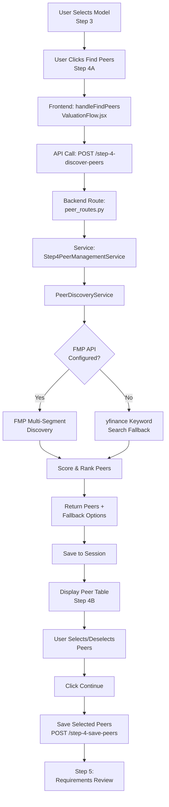

# Peer Finding Logic - Complete Workflow Documentation

## Overview
This document details the complete peer discovery and selection logic in the valuation platform, covering both frontend and backend implementations for the **International Market** (current production).

---

## Architecture: 3 Valuation Methods × 2 Markets
- **Methods**: DCF, DuPont, Trading Comps
- **Markets**: International (Current), Vietnam (Version 2 - Future)
- **Current Focus**: International Market ONLY

---

## Workflow Steps

### Step 4: Peer Discovery & Selection (Two Sub-steps)

#### **Step 4A: Find Peers** (Auto-discovery)
#### **Step 4B: Review/Adjust Peers** (Manual selection)

---

## Complete Data Flow



---

## Frontend Implementation

### 1. ValuationFlow.jsx - Main Orchestrator

**Location**: `/workspace/frontend/src/components/ValuationFlow.jsx`

#### handleFindPeers Function (Lines 275-337)

```javascript
const handleFindPeers = useCallback(async (company) => {
  setLoading(true);
  setError(null);

  // Validate model selection first - peer discovery requires model-specific criteria
  if (!selectedModels) {
    setError('Please select a valuation model in Step 3 first before finding peers');
    setLoading(false);
    return;
  }

  // Validate session exists
  if (!sessionId) {
    setError('No session found. Please select a company first.');
    setLoading(false);
    return;
  }

  // Validate market selection
  if (!['international', 'vietnam'].includes(market)) {
    setMarketValidation({
      isValid: false,
      message: 'Invalid market selection. Please select either International or Vietnam market.',
      selectedMarket: market
    });
    setError('Invalid market selection');
    setLoading(false);
    return;
  }

  try {
    const ticker = company.ticker || company.symbol;
    
    // KEY: Pass selected model for method-specific peer discovery
    // Include session_id to store suggestions and prevent re-fetching loop
    const data = await suggestPeers(
      ticker, 
      company.market || market, 
      10,              // max_peers
      selectedModels,  // method (DCF/COMPS/DuPont)
      sessionId        // session_id for caching
    );
    
    console.log('Suggest peers response:', data);
    
    if (data.suggested_peers && data.suggested_peers.length > 0) {
      setSuggestedPeers(data.suggested_peers);

      // Auto-select top 5 peers with highest scores
      const sortedPeers = [...data.suggested_peers].sort((a, b) => {
        const scoreA = a.match_score || a.score || 0;
        const scoreB = b.match_score || b.score || 0;
        return scoreB - scoreA;
      });
      
      const topPeers = sortedPeers.slice(0, Math.min(5, sortedPeers.length));
      setSelectedPeers(topPeers);

      console.log(`Auto-selected ${topPeers.length} peers:`, 
        topPeers.map(p => p.symbol || p.ticker));
      
      // Stay on Step 4 to review peers
    } else {
      setError('No peers found for this company.');
    }
  } catch (err) {
    console.error('Suggest peers error:', err);
    setError('Failed to find peers. Please ensure backend is running.');
  } finally {
    setLoading(false);
  }
}, [market, selectedModels, sessionId]);
```

#### Key Validation Points:
1. **Model must be selected first** (Step 3) - affects peer criteria
2. **Session must exist** - for caching suggestions
3. **Market must be valid** - 'international' or 'vietnam'

#### Method-Specific Behavior:
- **DCF**: Tighter market cap range (0.5x-2.0x), focus on similar cash flow profiles
- **COMPS**: Wider market cap range (0.3x-3.0x), focus on M&A comparables
- **DuPont**: Standard range, focus on operational efficiency metrics

---

### 2. api.js - API Service Layer

**Location**: `/workspace/frontend/src/services/api.js`

#### suggestPeers Function (Lines 64-73)

```javascript
export const suggestPeers = async (
  ticker, 
  market = 'international', 
  maxPeers = 10, 
  method = null, 
  sessionId = null
) => {
  const response = await api.post('/step-4-discover-peers', {
    ticker,
    market,
    max_peers: maxPeers,
    method: method,           // NEW: Pass valuation method
    session_id: sessionId     // NEW: For caching to prevent re-fetching
  });
  return response.data;
};
```

#### savePeers Function (Lines 82-85)

```javascript
export const savePeers = async (sessionId, peers) => {
  const response = await api.post('/step-4-save-peers', { 
    session_id: sessionId, 
    peers 
  });
  return response.data;
};
```

---

### 3. PeerSelectionStep.jsx - UI Component

**Location**: `/workspace/frontend/src/components/valuation-flow/PeerSelectionStep.jsx`

#### Key Features:
1. **Auto-find peers** on component mount if none exist
2. **Table display** with similarity scores and match reasons
3. **Select/Deselect** functionality with visual feedback
4. **Invalid peer detection** (indices, negative market cap)
5. **Select All / Deselect All** bulk actions

#### Peer Table Columns:
| Column | Description |
|--------|-------------|
| Select | Checkbox to toggle selection |
| Ticker | Stock symbol (indigo, bold) |
| Company Name | Full company name |
| Industry | Industry classification |
| Market Cap | Formatted ($B, $M, $T) |
| Similarity Score | Progress bar (0-100) with color coding |
| Match Reasons | Bullet list of why peer was selected |
| Status | Selected/Not Selected/Invalid badge |

#### Auto-Select Logic (Lines 25-32):
```javascript
useEffect(() => {
  if (!suggestedPeers || suggestedPeers.length === 0) {
    if (selectedCompany && onFindPeers && !loading && !hasFoundPeers) {
      setHasFoundPeers(true);
      onFindPeers(selectedCompany);
    }
  }
}, []);
```

---

## Backend Implementation

### 1. peer_routes.py - API Routes

**Location**: `/workspace/backend/app/api/routes/peer_routes.py`

#### Endpoint 1: POST /step-4-suggest-peers (Lines 26-69)

```python
@router.post("/step-4-suggest-peers")
async def suggest_peers_endpoint(request: dict):
    """
    Step 4: Suggest peer companies for a given ticker.
    Uses Step4PeerManagementService with PeerDiscoveryService.

    Args:
        ticker: Target ticker symbol (required)
        session_id: Session ID for session tracking (required)
        max_peers: Maximum number of peers to suggest (default: 10)
        market: Market type (default: international)
        method: Valuation method (DCF, COMPS, DuPont) - affects peer criteria

    Returns:
        List of peer candidates with similarity scores
    """
    ticker = request.get("ticker")
    session_id = request.get("session_id")
    max_peers = request.get("max_peers", 10)
    market = request.get("market", "international")
    method = request.get("method")  # NEW: valuation method

    # Validate required parameters
    if not ticker:
        raise HTTPException(status_code=400, detail="Missing required parameter: ticker")
    if not session_id:
        raise HTTPException(status_code=400, detail="Missing required parameter: session_id")

    logger.info(f"Suggesting peers for ticker='{ticker}', method='{method}', session_id='{session_id}'")

    try:
        result = await step4_processor.suggest_peers(
            ticker=ticker,
            session_id=session_id,
            max_peers=max_peers,
            market=market,
            method=method  # NEW: pass method
        )
        return result
    except Exception as e:
        logger.error(f"Failed to suggest peers: {str(e)}")
        raise HTTPException(status_code=500, detail=f"Peer suggestion failed: {str(e)}")
```

#### Endpoint 2: POST /step-5-validate-manual-peers (Lines 72-109)

```python
@router.post("/step-5-validate-manual-peers")
async def validate_manual_peers(request: dict):
    """
    Step 5: Validate manually entered peer tickers.

    Args:
        session_id: Session identifier (required)
        tickers: List of ticker symbols to validate (required)
        market: Market type (default: international)

    Returns:
        Dictionary with validated peers and any errors
    """
    session_id = request.get("session_id")
    tickers = request.get("tickers", [])
    market = request.get("market", "international")

    # Validate required parameters
    if not session_id:
        raise HTTPException(status_code=400, detail="Missing required parameter: session_id")
    if not tickers:
        raise HTTPException(status_code=400, detail="Missing required parameter: tickers")

    try:
        result = step4_processor.validate_peer_tickers(
            session_id=session_id,
            tickers=tickers
        )
        return result
    except Exception as e:
        logger.error(f"Failed to validate manual peers: {str(e)}")
        raise HTTPException(status_code=500, detail=f"Manual peer validation failed: {str(e)}")
```

---

### 2. step4_peer_management_service.py - Business Logic

**Location**: `/workspace/backend/app/services/international/step4_peer_management_service.py`

#### Class: Step4PeerManagementService

##### suggest_peers Method (Lines 220-348)

```python
async def suggest_peers(
    self,
    ticker: str,
    session_id: str,
    max_peers: int = 10,
    market: str = "international",
    method: Optional[str] = None  # NEW: valuation method
) -> Dict:
    """
    Suggest peer companies for a given ticker and save to session.
    """
    logger.info(f"Suggesting peers for ticker='{ticker}', method='{method}'")

    try:
        # Get ticker info first
        ticker_info = self.yfinance_service.get_ticker_info(ticker)

        if not ticker_info:
            return {
                "status": "failed",
                "message": f"Could not fetch data for {ticker}"
            }

        # Create peer discovery request with method
        request = PeerDiscoveryRequest(
            target_ticker=ticker,
            target_sector=ticker_info.get('sector'),
            target_industry=ticker_info.get('industry'),
            target_market_cap=ticker_info.get('marketCap'),
            max_peers=max_peers,
            market=market,
            method=method  # NEW: pass method
        )

        # Discover peers
        response = await self.peer_discovery_service.discover_peers(request)

        if response.total_found == 0 and not response.fallback_options:
            return {
                "status": "partial",
                "message": f"No suitable peers found for {ticker}",
                "warnings": response.warnings,
                "peers": [],
                "fallback_options": []
            }

        # Build peer list (auto-discovered peers only - NOT fallbacks)
        peers_list = [
            {
                "ticker": peer.ticker,
                "symbol": peer.symbol,
                "company_name": peer.company_name,
                "name": peer.name,
                "sector": peer.sector,
                "industry": peer.industry,
                "marketCap": peer.marketCap,
                "score": peer.score,
                "match_reasons": peer.match_reasons
            }
            for peer in response.peers
        ]

        # Build fallback options list (for manual dropdown selection ONLY)
        fallback_options_list = [
            {
                "ticker": fb.ticker,
                "symbol": fb.symbol,
                "company_name": fb.company_name,
                "name": fb.name,
                "sector": fb.sector,
                "industry": fb.industry,
                "marketCap": fb.marketCap,
                "score": fb.score,
                "match_reasons": fb.match_reasons,
                "is_fallback": True  # Flag for manual-selection options
            }
            for fb in response.fallback_options
        ]

        # CRUCIAL FIX: Save suggestions to session immediately to prevent re-fetching loop
        if session_id:
            session_service.update_session_data(
                session_id, 
                f"peer_suggestions_{ticker}", 
                peers_list
            )
            # Also save fallback options separately for dropdown display
            if fallback_options_list:
                session_service.update_session_data(
                    session_id,
                    f"peer_fallback_options_{ticker}",
                    fallback_options_list
                )
                logger.info(f"Saved {len(fallback_options_list)} fallback options for {ticker}")
            
            logger.info(f"Saved {len(peers_list)} peer suggestions to session for {ticker}")

        return {
            "status": "success",
            "message": f"Found {response.total_found} peer candidates for {ticker}",
            "target_company": {
                "ticker": ticker,
                "name": ticker_info.get('longName', ticker),
                "sector": ticker_info.get('sector'),
                "industry": ticker_info.get('industry'),
                "marketCap": ticker_info.get('marketCap')
            },
            "peers": peers_list,
            "fallback_options": fallback_options_list,  # Separate list for manual dropdown
            "search_criteria": response.search_criteria,
            "warnings": response.warnings
        }

    except Exception as e:
        logger.error(f"Error suggesting peers for {ticker}: {str(e)}")
        return {
            "status": "failed",
            "message": f"Failed to suggest peers: {str(e)}"
        }
```

##### save_peers_and_fetch_data Method (Lines 49-117)

**CRITICAL OPTIMIZATION**: Only saves BASIC INFO, does NOT fetch expensive WACC data.

```python
def save_peers_and_fetch_data(
    self,
    session_id: str,
    peers: List[Dict[str, Any]]
) -> Dict[str, Any]:
    """
    Save selected peers to session with BASIC INFO ONLY for UI display.
    
    CRITICAL CHANGE: Do NOT fetch expensive WACC data (Beta, Cost of Debt, Tax Rate) here.
    WACC data will be fetched in Step 10 when actually running valuation calculations.
    
    Workflow:
    1. Extract peer tickers from peer objects
    2. Validate tickers
    3. Save peer tickers and basic info to session (ticker, name, sector, industry, market_cap)
    4. Return basic peer list for UI display
    """
    # Validate session exists
    session = session_service.get_session_data(session_id)
    if not session:
        raise HTTPException(status_code=404, detail="Session not found")
    
    # Extract peer tickers
    peer_tickers = [peer.get('symbol') or peer.get('ticker') for peer in peers]
    peer_tickers = [t for t in peer_tickers if t]
    
    if not peer_tickers:
        raise HTTPException(status_code=400, detail="No valid peer tickers provided")
    
    # Save peer tickers to session
    session_service.update_session_data(session_id, "peer_tickers", peer_tickers)
    session_service.update_session_data(session_id, "selected_peers", peers)
    
    # Build peer_list with BASIC INFO ONLY for UI display (Step 4-5)
    # DO NOT fetch expensive WACC data here - that happens in Step 10
    peer_list = []
    for peer in peers:
        peer_list.append({
            "ticker": peer.get('symbol') or peer.get('ticker'),
            "name": peer.get('name') or peer.get('company_name'),
            "sector": peer.get('sector'),
            "industry": peer.get('industry'),
            "market_cap": peer.get('market_cap') or peer.get('marketCap'),
            "similarity_score": peer.get('similarity_score') or peer.get('score', 0)
        })
    
    # Store basic peer list in session for Step 5 requirements check
    session_service.update_shared_context(session_id, "peer_list", peer_list)
    
    logger.info(f"Saved {len(peer_tickers)} peers with basic info: {peer_tickers}")
    
    return {
        "status": "success",
        "message": f"Saved {len(peer_tickers)} peers with basic info",
        "peers_saved": len(peer_tickers),
        "peer_list": peer_list  # Basic info for UI, NOT full WACC data
    }
```

##### validate_peer_tickers Method (Lines 159-218)

```python
def validate_peer_tickers(
    self,
    session_id: str,
    tickers: List[str]
) -> Dict[str, Any]:
    """
    Validate a list of peer tickers.
    """
    # Validate session exists
    session = session_service.get_session_data(session_id)
    if not session:
        raise HTTPException(status_code=404, detail="Session not found")
    
    if not tickers:
        raise HTTPException(status_code=400, detail="No tickers provided")
    
    validated = []
    errors = []
    
    for ticker in tickers:
        try:
            # Try to fetch basic info to validate ticker exists
            ticker_info = self.yfinance_service.get_ticker_info(ticker)
            
            if ticker_info and ticker_info.get('currentPrice'):
                validated.append({
                    'ticker': ticker,
                    'valid': True,
                    'name': ticker_info.get('shortName', ticker),
                    'exchange': ticker_info.get('exchange', 'Unknown')
                })
            else:
                errors.append({
                    'ticker': ticker,
                    'valid': False,
                    'error': 'Ticker not found or no price data available'
                })
                
        except Exception as e:
            errors.append({
                'ticker': ticker,
                'valid': False,
                'error': str(e)
            })
    
    return {
        "validated_peers": validated,
        "invalid_peers": errors,
        "total_validated": len(validated),
        "total_invalid": len(errors)
    }
```

---

### 3. peer_discovery_service.py - Core Discovery Engine

**Location**: `/workspace/backend/app/services/international/peer_discovery_service.py`

#### Class: PeerDiscoveryService

##### discover_peers Method (Lines 105-264)

**Key Features**:
1. **Progressive Filter Relaxation**: 3-pass search (Strict → Moderate → Broad)
2. **Method-Specific Market Cap Ranges**: Different ranges for DCF vs COMPS
3. **Hybrid Approach**: FMP multi-segment discovery with yfinance fallback
4. **Separate Fallback Options**: Not auto-included, for manual selection only

```python
async def discover_peers(
    self,
    request: PeerDiscoveryRequest
) -> PeerDiscoveryResponse:
    """
    Discover peer companies for a target ticker with progressive fallback relaxation.
    """
    logger.info(f"Discovering peers for '{request.target_ticker}', method='{request.method}'")
    warnings = []

    # Get target company info if not provided
    target_sector = request.target_sector
    target_industry = request.target_industry
    target_market_cap = request.target_market_cap
    method = request.method  # NEW: valuation method

    if not all([target_sector, target_industry, target_market_cap]):
        ticker_info = self.yfinance_service.get_ticker_info(request.target_ticker)
        if ticker_info:
            target_sector = target_sector or ticker_info.get('sector')
            target_industry = target_industry or ticker_info.get('industry')
            target_market_cap = target_market_cap or ticker_info.get('marketCap')

    if not target_sector and not target_industry:
        warnings.append("No sector or industry information available")
        return PeerDiscoveryResponse(
            target_ticker=request.target_ticker,
            peers=[],
            total_found=0,
            search_criteria={'sector': None, 'industry': None, 'market_cap_range': None, 'method': method},
            warnings=warnings
        )

    # Multi-pass search: Start strict, loosen if we don't find enough peers
    relaxation_passes = [
        {"label": "Strict", "dcf_mult": (0.5, 2.0), "comps_mult": (0.3, 3.0), "default_mult": (0.4, 2.5)},
        {"label": "Moderate", "dcf_mult": (0.25, 4.0), "comps_mult": (0.15, 6.0), "default_mult": (0.2, 5.0)},
        {"label": "Broad", "dcf_mult": (0.05, 10.0), "comps_mult": (0.05, 10.0), "default_mult": (0.05, 10.0)}
    ]

    top_peers = []
    fallback_options = []  # Store fallback options separately for manual selection
    search_criteria = {}

    for pas in relaxation_passes:
        if len(top_peers) >= request.max_peers:
            break

        logger.info(f"Running peer discovery pass: {pas['label']}")

        # Determine market cap range for this pass
        market_cap_min = None
        market_cap_max = None
        if target_market_cap:
            if method == "DCF":
                mult_min, mult_max = pas["dcf_mult"]
            elif method == "COMPS":
                mult_min, mult_max = pas["comps_mult"]
            else:
                mult_min, mult_max = pas["default_mult"]

            market_cap_min = target_market_cap * mult_min
            market_cap_max = target_market_cap * mult_max

        search_criteria = {
            'sector': target_sector,
            'industry': target_industry,
            'market_cap_range': f"${market_cap_min/1e9:.1f}B - ${market_cap_max/1e9:.1f}B" if market_cap_min else "Any",
            'allowed_exchanges': request.allowed_exchanges,
            'method': method
        }

        allowed_exchanges = self._get_allowed_exchanges(request.market, request.allowed_exchanges)

        # Search for candidates
        peer_candidates = await self._search_peer_candidates(
            sector=target_sector,
            industry=target_industry,
            market_cap_min=market_cap_min,
            market_cap_max=market_cap_max,
            exclude_ticker=request.target_ticker,
            max_results=request.max_peers * 4,  # Expanded multiplier pool
            allowed_exchanges=allowed_exchanges,
            method=method
        )

        # Score and rank candidates
        scored_peers = self._score_and_rank_peers(
            candidates=peer_candidates,
            target_sector=target_sector,
            target_industry=target_industry,
            target_market_cap=target_market_cap,
            method=method
        )

        # Deduplicate and merge into top_peers
        existing_symbols = {p.symbol for p in top_peers}
        for peer in scored_peers:
            if peer.symbol not in existing_symbols:
                top_peers.append(peer)
                existing_symbols.add(peer.symbol)

    # If we still don't have enough peers after all relaxation passes,
    # fetch fallback options but DO NOT auto-include them - they're for manual selection only
    if len(top_peers) < request.max_peers:
        warnings.append(f"Only found {len(top_peers)} suitable peers out of {request.max_peers} requested.")
        
        # Fetch fallback options from predefined lists (for manual user selection via dropdown)
        fallback_raw = await self._get_fallback_peers(
            sector=target_sector,
            industry=target_industry,
            exclude_tickers={request.target_ticker} | {p.symbol for p in top_peers},
            allowed_exchanges=allowed_exchanges
        )
        
        # Convert fallback raw dicts to PeerCandidate objects
        for fb in fallback_raw:
            try:
                fallback_peer = PeerCandidate(
                    symbol=fb['symbol'],
                    ticker=fb['symbol'],
                    name=fb.get('name', fb['symbol']),
                    company_name=fb.get('name', fb['symbol']),
                    exchange=fb.get('exchange', ''),
                    sector=fb.get('sector'),
                    industry=fb.get('industry'),
                    market_cap=fb.get('market_cap'),
                    marketCap=fb.get('market_cap'),
                    current_price=fb.get('current_price'),
                    beta=fb.get('beta'),
                    similarity_score=0.0,
                    score=0.0,
                    match_reasons=['fallback_option']
                )
                fallback_options.append(fallback_peer)
            except Exception as e:
                logger.debug(f"Failed to create fallback peer object: {e}")

    # Final slice - only include auto-discovered peers, NOT fallback options
    top_peers = top_peers[:request.max_peers]

    return PeerDiscoveryResponse(
        target_ticker=request.target_ticker,
        peers=top_peers,
        total_found=len(top_peers),
        search_criteria=search_criteria,
        warnings=warnings,
        fallback_options=fallback_options  # Separate list for manual dropdown selection
    )
```

##### _search_peer_candidates Method (Lines 266-309)

**HYBRID IMPLEMENTATION**: FMP multi-segment with yfinance fallback

```python
async def _search_peer_candidates(
    self,
    sector: Optional[str],
    industry: Optional[str],
    market_cap_min: Optional[float],
    market_cap_max: Optional[float],
    exclude_ticker: str,
    max_results: int = 30,
    allowed_exchanges: Optional[List[str]] = None,
    method: Optional[str] = None
) -> List[Dict]:
    """
    HYBRID IMPLEMENTATION:
    Prioritizes institutional multi-segment tracking via FMP, falls back to yfinance keyword filtering.
    """
    # PATH A: If FMP is configured, try the advanced multi-segment route
    if self.fmp_api_key:
        try:
            logger.info("FMP API key detected. Initiating multi-segment discovery pool...")
            return await self._search_via_fmp_segments(
                sector, industry, market_cap_min, market_cap_max, exclude_ticker, max_results, allowed_exchanges
            )
        except Exception as e:
            logger.error(f"FMP Advanced discovery failed ({str(e)}). Falling back to yfinance...")
            # Fall through to PATH B gracefully

    # PATH B: Fallback / Default engine using current yfinance logic
    logger.info("Executing standard yfinance single-label search fallback.")
    return await self._search_via_yfinance_fallback(
        sector, industry, market_cap_min, market_cap_max, exclude_ticker, max_results, allowed_exchanges
    )
```

##### _score_and_rank_peers Method (Lines 710-871)

**Scoring Methodology**:

| Criteria | Points | Description |
|----------|--------|-------------|
| Sub-industry match (exact) | +50 | Exact industry string match |
| Industry match (similar) | +30 | Partial match via key terms |
| Sector match | +15 | Same sector classification |
| Market cap within range | +25 | Within method-specific range |
| Market cap proximity | +10 | Closer to target = higher |
| Same country/region | +5 | Same exchange region |

**Method-Specific Adjustments**:

```python
def _score_and_rank_peers(
    self,
    candidates: List[Dict],
    target_sector: Optional[str],
    target_industry: Optional[str],
    target_market_cap: Optional[float],
    method: Optional[str] = None
) -> List[PeerCandidate]:
    """
    Score and rank peer candidates with method-specific adjustments.
    """
    scored_peers = []
    method = method or "DCF"  # Default to DCF if not specified

    for candidate in candidates:
        score = 0.0
        match_reasons = []

        # INDUSTRY MATCHING WITH SUB-INDUSTRY WEIGHTING
        if target_industry and candidate.get('industry'):
            cand_industry = candidate['industry'].lower()
            target_industry_lower = target_industry.lower()

            # Check for exact sub-industry match (+50 points)
            if cand_industry == target_industry_lower:
                score += 50
                match_reasons.append("Exact sub-industry match")
            # Check for partial industry match (contains key terms) (+30 points)
            elif self._industries_are_similar(target_industry_lower, cand_industry):
                score += 30
                match_reasons.append("Similar industry")

        # Sector match (+15 points) - only if no industry match found
        if target_sector and candidate.get('sector'):
            if candidate['sector'].lower() == target_sector.lower():
                if not any("industry" in reason.lower() for reason in match_reasons):
                    score += 15
                    match_reasons.append("Same sector")

        # Market cap range match (+25 points) - METHOD-SPECIFIC
        candidate_market_cap = candidate.get('market_cap')
        if target_market_cap and candidate_market_cap:
            ratio = candidate_market_cap / target_market_cap

            if method == "COMPS":
                # COMPS: Wider range acceptable, focus on M&A comparables
                comps_range_min = 0.3
                comps_range_max = 3.0
                if comps_range_min <= ratio <= comps_range_max:
                    score += 25
                    match_reasons.append("Comparable for M&A analysis")

                    # Proximity scoring adjusted for COMPS
                    distance_from_perfect = abs(1.0 - ratio)
                    proximity_score = max(0, 10 - (distance_from_perfect * 8))
                    score += proximity_score

                    if proximity_score > 7:
                        match_reasons.append("Good M&A comparable size")

                    # Bonus for potential acquisition targets
                    if ratio < 1.5:
                        score += 5
                        match_reasons.append("Potential acquisition target")

            elif method == "DCF":
                # DCF: Tighter range, focus on similar cash flow profiles
                if self.MARKET_CAP_RANGE_MIN <= ratio <= self.MARKET_CAP_RANGE_MAX:
                    score += 25
                    match_reasons.append("Similar cash flow profile")

                    # Proximity scoring - stricter for DCF
                    distance_from_perfect = abs(1.0 - ratio)
                    proximity_score = max(0, 10 - (distance_from_perfect * 12))
                    score += proximity_score

                    if proximity_score > 7:
                        match_reasons.append("Very close market cap")

                    # Bonus for similar growth characteristics
                    if 0.7 <= ratio <= 1.4:
                        score += 5
                        match_reasons.append("Similar growth stage")

            else:
                # Default or DuPont - standard scoring
                if self.MARKET_CAP_RANGE_MIN <= ratio <= self.MARKET_CAP_RANGE_MAX:
                    score += 25
                    match_reasons.append("Similar market cap")

                    # Proximity scoring (+10 points max)
                    distance_from_perfect = abs(1.0 - ratio)
                    proximity_score = max(0, 10 - (distance_from_perfect * 10))
                    score += proximity_score

                    if proximity_score > 7:
                        match_reasons.append("Very close market cap")

        # Country/region match bonus (+5 points)
        if candidate.get('exchange') and self._is_same_region(candidate.get('exchange'), target_market_cap):
            score += 5
            match_reasons.append("Same region")

        # Create peer candidate
        peer = PeerCandidate(
            symbol=candidate['symbol'],
            ticker=candidate['symbol'],
            name=candidate['name'],
            company_name=candidate['name'],
            exchange=candidate['exchange'],
            sector=candidate.get('sector'),
            industry=candidate.get('industry'),
            market_cap=candidate_market_cap,
            marketCap=candidate_market_cap,
            current_price=candidate.get('current_price'),
            beta=candidate.get('beta'),
            similarity_score=score,
            score=score,
            match_reasons=match_reasons
        )

        scored_peers.append(peer)

    # Sort by score descending
    scored_peers.sort(key=lambda x: x.similarity_score, reverse=True)

    return scored_peers
```

##### _get_fallback_peers Method (Lines 625-708)

**Predefined Lists by Sector** for when automatic discovery fails:

```python
async def _get_fallback_peers(
    self,
    sector: Optional[str],
    industry: Optional[str],
    exclude_tickers: set,
    allowed_exchanges: Optional[List[str]] = None
) -> List[Dict]:
    """
    Get fallback peers from known company lists by sector.
    These are ONLY for manual user selection via dropdown, NOT auto-included.
    """
    # Known companies by sector (can be expanded)
    fallback_companies = {
        'Technology': ['AAPL', 'MSFT', 'GOOGL', 'META', 'NVDA', 'AMD', 'INTC', 'CRM', 'ORCL', 'ADBE'],
        'Healthcare': ['JNJ', 'UNH', 'PFE', 'MRK', 'ABBV', 'TMO', 'ABT', 'DHR', 'BMY', 'LLY'],
        'Financial Services': ['BRK.B', 'JPM', 'V', 'MA', 'BAC', 'WFC', 'GS', 'MS', 'C', 'AXP'],
        'Consumer Cyclical': ['AMZN', 'TSLA', 'HD', 'MCD', 'NKE', 'SBUX', 'LOW', 'TJX', 'BKNG', 'CMG'],
        'Communication Services': ['GOOGL', 'META', 'DIS', 'NFLX', 'CMCSA', 'VZ', 'T', 'TMUS', 'CHTR', 'EA'],
        'Industrials': ['BA', 'CAT', 'UNP', 'HON', 'UPS', 'RTX', 'LMT', 'DE', 'GE', 'MMM'],
        'Consumer Defensive': ['WMT', 'PG', 'KO', 'PEP', 'COST', 'PM', 'MO', 'MDLZ', 'CL', 'KMB'],
        'Energy': ['XOM', 'CVX', 'COP', 'SLB', 'EOG', 'MPC', 'PSX', 'VLO', 'OXY', 'HAL'],
        'Utilities': ['NEE', 'DUK', 'SO', 'D', 'AEP', 'EXC', 'SRE', 'XEL', 'WEC', 'ED'],
        'Real Estate': ['AMT', 'PLD', 'CCI', 'EQIX', 'PSA', 'SPG', 'WELL', 'DLR', 'O', 'SBAC'],
        'Basic Materials': ['LIN', 'APD', 'SHW', 'ECL', 'FCX', 'NEM', 'DOW', 'DD', 'PPG', 'NUE']
    }

    results = []

    # Map sector to fallback list
    sector_key = sector
    if not sector_key or sector_key not in fallback_companies:
        # Try to find partial match
        for key in fallback_companies.keys():
            if sector and key.lower() in sector.lower():
                sector_key = key
                break

    if sector_key and sector_key in fallback_companies:
        # CONCURRENT FIX: Fetch all ticker info in parallel using asyncio.gather
        async def fetch_fallback_ticker(ticker: str) -> Optional[Dict]:
            try:
                ticker_info = await run_in_executor(self.yfinance_service.get_ticker_info, ticker)
                if not ticker_info or not ticker_info.get('currentPrice'):
                    return None

                exchange = ticker_info.get('exchange', '')
                if not self._is_exchange_allowed(exchange, allowed_exchanges):
                    logger.debug(f"Excluding fallback peer {ticker}: exchange '{exchange}' not allowed")
                    return None

                return {
                    'symbol': ticker,
                    'name': ticker_info.get('longName', ticker),
                    'exchange': exchange,
                    'sector': ticker_info.get('sector'),
                    'industry': ticker_info.get('industry'),
                    'market_cap': ticker_info.get('marketCap'),
                    'current_price': ticker_info.get('currentPrice'),
                    'beta': ticker_info.get('beta')
                }
            except Exception as e:
                logger.debug(f"Failed fetching fallback ticker {ticker}: {e}")
                return None

        # Filter out excluded tickers first
        valid_tickers = [t for t in fallback_companies[sector_key] if t not in exclude_tickers]
        
        # Fetch all in parallel
        tasks = [fetch_fallback_ticker(t) for t in valid_tickers]
        fetched_results = await asyncio.gather(*tasks)
        
        # Filter out None values
        results = [r for r in fetched_results if r is not None]

    return results
```

---

## Request/Response Schemas

### POST /step-4-discover-peers

**Request**:
```json
{
  "ticker": "AAPL",
  "market": "international",
  "max_peers": 10,
  "method": "DCF",
  "session_id": "abc-123-xyz"
}
```

**Response**:
```json
{
  "status": "success",
  "message": "Found 10 peer candidates for AAPL",
  "target_company": {
    "ticker": "AAPL",
    "name": "Apple Inc.",
    "sector": "Technology",
    "industry": "Consumer Electronics",
    "marketCap": 2800000000000
  },
  "peers": [
    {
      "ticker": "MSFT",
      "symbol": "MSFT",
      "company_name": "Microsoft Corporation",
      "name": "Microsoft Corporation",
      "sector": "Technology",
      "industry": "Software—Infrastructure",
      "marketCap": 2700000000000,
      "score": 92.5,
      "match_reasons": [
        "Similar industry",
        "Similar cash flow profile",
        "Very close market cap",
        "Similar growth stage"
      ]
    }
  ],
  "fallback_options": [
    {
      "ticker": "GOOGL",
      "symbol": "GOOGL",
      "company_name": "Alphabet Inc.",
      "name": "Alphabet Inc.",
      "sector": "Communication Services",
      "industry": "Internet Content & Information",
      "marketCap": 1700000000000,
      "score": 0.0,
      "match_reasons": ["fallback_option"],
      "is_fallback": true
    }
  ],
  "search_criteria": {
    "sector": "Technology",
    "industry": "Consumer Electronics",
    "market_cap_range": "$1.4T - $5.6T",
    "method": "DCF"
  },
  "warnings": []
}
```

### POST /step-4-save-peers

**Request**:
```json
{
  "session_id": "abc-123-xyz",
  "peers": [
    {
      "ticker": "MSFT",
      "symbol": "MSFT",
      "company_name": "Microsoft Corporation",
      "sector": "Technology",
      "industry": "Software—Infrastructure",
      "marketCap": 2700000000000
    },
    {
      "ticker": "GOOGL",
      "symbol": "GOOGL",
      "company_name": "Alphabet Inc.",
      "sector": "Communication Services",
      "industry": "Internet Content & Information",
      "marketCap": 1700000000000
    }
  ]
}
```

**Response**:
```json
{
  "status": "success",
  "message": "Saved 2 peers with basic info",
  "peers_saved": 2,
  "peer_list": [
    {
      "ticker": "MSFT",
      "name": "Microsoft Corporation",
      "sector": "Technology",
      "industry": "Software—Infrastructure",
      "market_cap": 2700000000000,
      "similarity_score": 92.5
    },
    {
      "ticker": "GOOGL",
      "name": "Alphabet Inc.",
      "sector": "Communication Services",
      "industry": "Internet Content & Information",
      "market_cap": 1700000000000,
      "similarity_score": 0.0
    }
  ]
}
```

---

## Performance Optimizations

### 1. Session Caching (Prevents Re-fetching Loop)
- Peer suggestions saved to session immediately after discovery
- Key format: `peer_suggestions_{ticker}`
- Prevents redundant API calls when navigating back/forth

### 2. Concurrent Fetching
- Uses `asyncio.gather()` for parallel ticker info retrieval
- Applies to both discovery and fallback peer fetching
- Reduces latency from sequential API calls

### 3. Progressive Relaxation
- 3-pass search strategy (Strict → Moderate → Broad)
- Stops early if enough peers found
- Saves API calls and processing time

### 4. Basic Info Only in Step 4
- Does NOT fetch expensive WACC data (Beta, Cost of Debt, Tax Rate)
- WACC data fetched in Step 10 during actual valuation
- Reduces initial load time significantly

---

## Method-Specific Peer Criteria

### DCF (Discounted Cash Flow)
- **Market Cap Range**: 0.5x - 2.0x of target (tighter)
- **Focus**: Similar cash flow profiles, growth stages
- **Proximity Penalty**: Stricter (12x multiplier)
- **Bonus**: Similar growth stage (0.7x - 1.4x range)

### COMPS (Trading Comparables)
- **Market Cap Range**: 0.3x - 3.0x of target (wider)
- **Focus**: M&A comparables, acquisition targets
- **Proximity Penalty**: More lenient (8x multiplier)
- **Bonus**: Potential acquisition target (< 1.5x target)

### DuPont Analysis
- **Market Cap Range**: 0.5x - 2.0x of target (standard)
- **Focus**: Operational efficiency metrics
- **Proximity Penalty**: Standard (10x multiplier)
- **Bonus**: None specific

---

## Exchange Filtering (International Market)

### Allowed Exchanges:
```python
MARKET_EXCHANGE_FILTERS = {
    "international": ["NMS", "NYQ", "NGM", "NCM"],  # NASDAQ, NYSE
    "vietnam": ["HOSE", "HNX", "UPCOM"],  # Vietnam exchanges (v2)
    "us": ["NMS", "NYQ", "NGM", "NCM"],
    "uk": ["LSE"],
    "eu": ["GER", "FRA", "BER", "MUN", "STU", "DUS"],  # German exchanges
    "jp": ["JPX"],
    "au": ["ASX"],
}
```

### Excluded Exchanges:
```python
EXCLUDED_EXCHANGES = {"PNK", "GRE", "OTC", "BTS", "NCY"}
```

---

## Error Handling

### Frontend Errors:
1. **No model selected**: "Please select a valuation model in Step 3 first"
2. **No session**: "No session found. Please select a company first."
3. **Invalid market**: "Invalid market selection"
4. **API failure**: "Failed to find peers. Please ensure backend is running."
5. **No peers found**: "No peers found for this company."

### Backend Errors:
1. **Missing ticker**: HTTP 400 - "Missing required parameter: ticker"
2. **Missing session_id**: HTTP 400 - "Missing required parameter: session_id"
3. **Session not found**: HTTP 404 - "Session not found"
4. **No tickers provided**: HTTP 400 - "No tickers provided"
5. **Server error**: HTTP 500 - Detailed error message

---

## Testing Checklist

### Unit Tests Needed:
- [ ] `_score_and_rank_peers()` with different methods (DCF/COMPS/DuPont)
- [ ] `_get_fallback_peers()` sector matching
- [ ] `_industries_are_similar()` partial matching
- [ ] `save_peers_and_fetch_data()` basic info only
- [ ] `validate_peer_tickers()` valid/invalid detection

### Integration Tests Needed:
- [ ] Full peer discovery flow (Step 4A → 4B)
- [ ] Session caching prevents re-fetching
- [ ] Method-specific criteria applied correctly
- [ ] Fallback options displayed but not auto-included
- [ ] Concurrent fetching performance improvement

### E2E Tests Needed:
- [ ] User selects DCF model → finds peers → sees DCF-specific criteria
- [ ] User selects COMPS model → finds peers → sees wider market cap range
- [ ] User manually adds invalid ticker → validation error shown
- [ ] User navigates back/forth → cached peers displayed

---

## Future Enhancements (Vietnam Market - Version 2)

1. **Vietnamese Peer Discovery**:
   - Integrate with FiinTrade API for Vietnamese stocks
   - Support HOSE, HNX, UPCOM exchanges
   - Handle Vietnamese sector classifications

2. **Cross-Border Peers**:
   - Option to include regional peers (ASEAN)
   - Currency conversion for market cap comparison
   - Regional exchange filtering

3. **Enhanced Scoring**:
   - Machine learning-based similarity scoring
   - Historical correlation analysis
   - Supply chain relationship mapping

4. **Custom Peer Lists**:
   - User-defined peer groups
   - Save/load peer templates
   - Industry-standard peer benchmarks

---

## Related Files

### Frontend:
- `/workspace/frontend/src/components/ValuationFlow.jsx` - Main orchestrator
- `/workspace/frontend/src/components/valuation-flow/PeerSelectionStep.jsx` - UI component
- `/workspace/frontend/src/services/api.js` - API service layer
- `/workspace/frontend/src/services/peerSelectionService.js` - Peer service abstraction

### Backend:
- `/workspace/backend/app/api/routes/peer_routes.py` - API routes
- `/workspace/backend/app/services/international/step4_peer_management_service.py` - Business logic
- `/workspace/backend/app/services/international/peer_discovery_service.py` - Core discovery engine
- `/workspace/backend/app/services/international/yfinance_service.py` - Data fetching
- `/workspace/backend/app/core/session_service.py` - Session management

---

## Conclusion

The peer finding logic implements a sophisticated, method-aware discovery system with:

1. **Progressive relaxation** for robust peer identification
2. **Method-specific criteria** for DCF, COMPS, and DuPont valuations
3. **Hybrid discovery** using FMP (institutional) and yfinance (fallback)
4. **Performance optimizations** via caching and concurrent fetching
5. **Clear separation** between auto-discovered peers and manual fallback options
6. **Unified schemas** for consistent frontend-backend communication

All development is currently focused on the **International Market**, with Vietnamese market support planned for Version 2.
