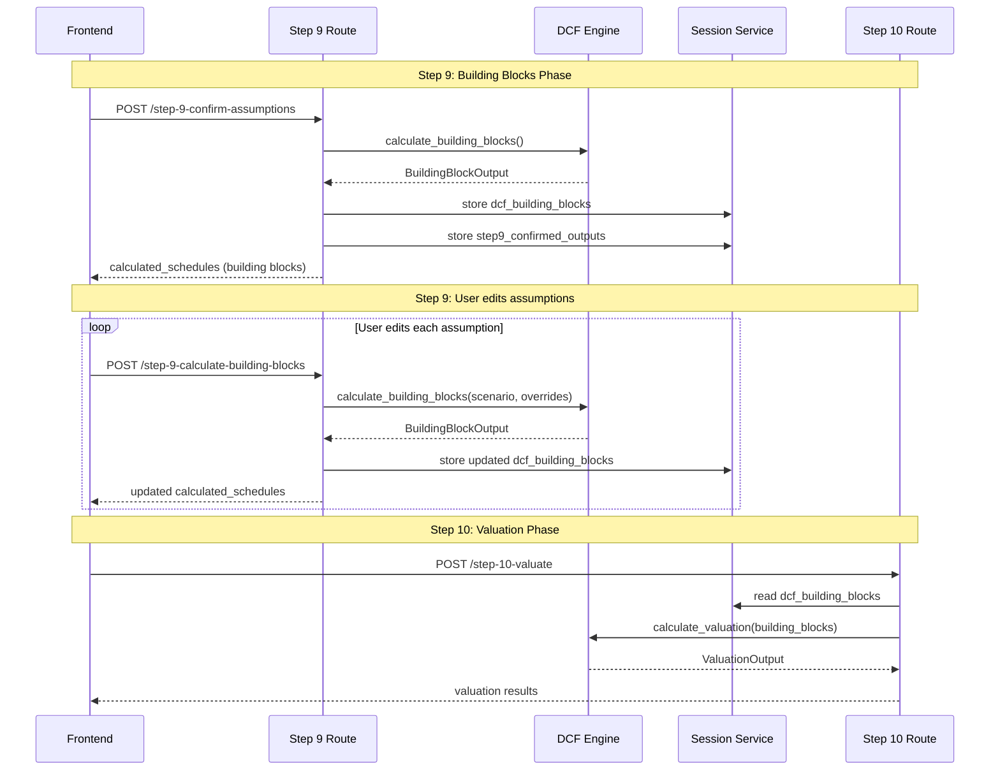
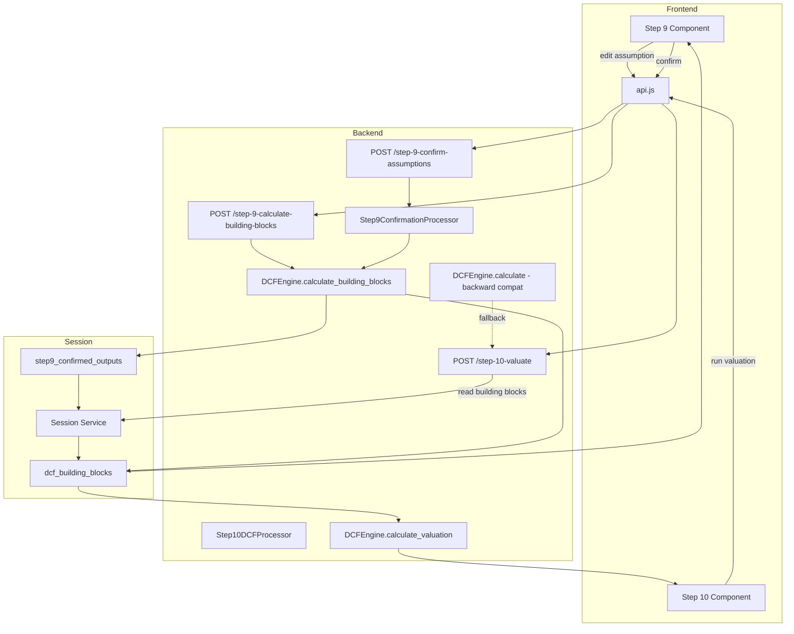

# DCF Engine Phase Split: Two-Phase Calculation with Separate Endpoints

> **Created**: 2026-06-13
> **Status**: PLAN — Awaiting Review
> **Scope**: Split DCFEngine.calculate() into calculate_building_blocks() + calculate_valuation(), add backend endpoints, remove client-side dcfCalculator.ts

---

## 1. Problem Statement

### Current Architecture

```
Step 9 (frontend):
  ├── Calls backend POST /step-9-confirm-assumptions
  ├── Backend runs FULL DCFEngine.calculate() → stores dcf_engine_output in session
  ├── Response includes calculated_schedules (building blocks extracted from full output)
  └── Frontend ALSO runs dcfCalculator.ts (client-side) for instant recalculation on edits

Step 10 (frontend):
  ├── Calls backend POST /step-10-valuate
  ├── Backend reads stored dcf_engine_output from session (re-runs if missing)
  └── Frontend ALSO runs dcfCalculator.ts again for display
```

### What's Wrong

| Issue | Impact |
|-------|--------|
| Frontend `dcfCalculator.ts` (994 lines) duplicates backend DCFEngine logic | Two codebases to maintain; divergent bugs |
| Step 9 frontend edits to building blocks never reach the backend | User edits displayed locally are stale vs. backend truth |
| Backend runs FULL engine at Step 9 including valuation phases | Wasted computation; Step 9 only needs building blocks |
| Step 10 reads stale `dcf_engine_output` that doesn't reflect Step 9 edits | Valuation uses outdated assumptions |
| No single source of truth for building block schedules | Frontend and backend can show different numbers |

### Target Architecture

```
Step 9 (frontend):
  ├── User edits assumptions → calls POST /step-9-calculate-building-blocks
  ├── Backend runs DCFEngine.calculate_building_blocks() → returns building block schedules
  ├── Frontend displays building block schedules from backend (NO client-side calculator)
  └── User confirms → stores building blocks in session

Step 10 (frontend):
  ├── User clicks "Run Valuation" → calls POST /step-10-valuate
  ├── Backend runs DCFEngine.calculate_valuation() using stored building blocks
  └── Frontend displays valuation results from backend
```

---

## 2. DCFEngine Split Design

### 2A. Current `calculate()` Method Phases (lines 1584-1839)

**Building Block Phases (to become `calculate_building_blocks()`):**

| Phase | Lines | Method | Output |
|-------|-------|--------|--------|
| WACC | 1596 | `calculate_wacc()` | wacc, avg_unlev_beta, lev_beta, cost_of_equity |
| Revenue | 1608 | `_build_revenue_schedule(drivers)` | revenue list |
| COGS | 1611 | `_build_cogs_schedule(drivers)` | cogs list |
| Gross Profit | 1614 | `revenue - cogs` | gross_profit list |
| SG&A | 1617 | `_build_opex_schedule(drivers, hist_sga)` | sga list |
| Other OpEx | 1618 | `_build_opex_schedule(drivers, hist_other)` | other_opex list |
| EBITDA | 1621 | `gp - sga - other` | ebitda list |
| Depreciation | 1624 | `_build_depreciation_schedule(drivers)` | depr_schedule |
| EBIT | 1629 | `ebitda - depreciation` | ebit list |
| Interest | 1632 | constant `projected_interest_expense` | interest list |
| EBT | 1635 | `ebit - interest` | ebt list |
| Working Capital | 1638 | `_build_working_capital_schedule(drivers, revenue, cogs)` | wc_schedule |
| Tax Levered | 1641 | `_build_tax_schedule_levered(ebt, dep, ...)` | tax_levered |
| Tax Unlevered | 1642 | `_build_tax_schedule_unlevered(ebit, dep, ...)` | tax_unlevered |
| Net Income | 1645 | `ebt - total_tax` | net_income list |
| Income Statement | 1710 | `IncomeStatement(...)` | income_stmt |
| Cash Flow Statement | 1729 | `_build_cash_flow_statement(...)` | cfs |
| Balance Sheet | 1735 | `_build_balance_sheet(...)` | bs |

**Valuation Phases (to become `calculate_valuation()`):**

| Phase | Lines | Method | Output |
|-------|-------|--------|--------|
| UFCF | 1648 | `_calculate_ufcf(ebitda, tax_unlevered, capex, nwc, ...)` | ufcf_schedule |
| Partial Period | 1658 | `_calculate_partial_period_factor(...)` | partial_factor, yearfractions |
| TV Perpetuity | 1670 | `terminal_ufcf * (1+g) / (wacc - g)` | tv_perpetuity |
| DCF Perpetuity | 1673 | `_discount_cash_flows(ufcf, tv_perp, wacc, ...)` | perpetuity_dcf |
| TV Multiple | 1685 | `terminal_ebitda * multiple` | tv_multiple |
| DCF Multiple | 1688 | `_discount_cash_flows(ufcf, tv_mult, wacc, ...)` | multiple_dcf |
| Equity Values | 1697-1707 | `ev - net_debt`, per share, premium | equity values |
| Intrinsic Extracts | 1740 | `_build_intrinsic_extracts(...)` | intrinsic |
| UFCF 3 Methods | 1747 | `_build_ufcf_3methods(...)` | ufcf_3m |
| NPV/XNPV/IRR | 1755 | `_build_npv_xnpv(...)` | npv_result |
| Sensitivity | 1761-1763 | `calculate_sensitivity_perpetuity/multiple(...)` | sensitivity tables |

### 2B. New Output Dataclasses

```python
@dataclass
class BuildingBlockOutput:
    """
    Output of calculate_building_blocks() — projected financial statements.
    Phase 1 of the DCF calculation. Shown to user for review in Step 9.
    """
    # WACC calculation
    wacc: float
    avg_unlevered_beta: float
    levered_beta: float
    cost_of_equity: float
    after_tax_cost_of_debt: float

    # Projected schedules (6 periods: FY1-FY5 + Terminal)
    revenue: List[float]
    cogs: List[float]
    gross_profit: List[float]
    sga: List[float]
    other_opex: List[float]
    ebitda: List[float]
    depreciation_schedule: DepreciationSchedule
    depreciation: List[float]
    ebit: List[float]
    interest: List[float]
    ebt: List[float]

    # Schedules
    income_statement: IncomeStatement
    working_capital: WorkingCapitalSchedule
    tax_levered: TaxSchedule
    tax_unlevered: TaxSchedule

    # Net Income
    net_income: List[float]

    # Financial Statements (building blocks)
    cash_flow_statement: CashFlowStatement
    balance_sheet: BalanceSheet

    # Validation
    validation_flags: Dict[str, bool]
    warnings: List[str]

    # Metadata
    scenario: str
    valuation_date: date

    def to_dict(self) -> Dict[str, Any]:
        """Serialize for JSON transport and session storage."""
        ...
```

```python
@dataclass
class ValuationOutput:
    """
    Output of calculate_valuation() — UFCF, DCF, valuation results.
    Phase 2 of the DCF calculation. Shown to user in Step 10.
    """
    # UFCF
    ufcf: UFCFSchedule

    # DCF details
    perpetuity_dcf: DCFValuationDetails
    multiple_dcf: DCFValuationDetails

    # Valuation results
    perpetuity_method: ValuationResult
    exit_multiple_method: ValuationResult

    # Supporting analysis
    intrinsic_extracts: Optional[IntrinsicExtracts]
    ufcf_3_methods: Optional[UFCFMethods]
    npv_xnpv: Optional[NPVResult]
    sensitivity_perpetuity: Optional[Dict]
    sensitivity_multiple: Optional[Dict]

    # Validation
    ufcf_methods_reconcile: bool
    validation_flags: Dict[str, bool]
    warnings: List[str]

    # Metadata
    scenario: str
    valuation_date: date

    def to_dict(self) -> Dict[str, Any]:
        """Serialize for JSON transport."""
        ...
```

### 2C. New Method Signatures

```python
class DCFEngine:

    def calculate_building_blocks(self, scenario: str = "base_case") -> BuildingBlockOutput:
        """
        Phase 1: Calculate building block schedules (WACC through Net Income + IS/CFS/BS).

        Runs Phases 1-18 of the current calculate() method:
        - WACC, Revenue, COGS, Gross Profit, SG&A, Other OpEx, EBITDA
        - Depreciation, EBIT, Interest, EBT
        - Working Capital, Tax Levered, Tax Unlevered, Net Income
        - Income Statement, Cash Flow Statement, Balance Sheet

        Does NOT run: UFCF, DCF, terminal value, equity values, sensitivity.

        Args:
            scenario: Scenario name (base_case, best_case, worst_case)

        Returns:
            BuildingBlockOutput with all projected financial statement schedules
        """
        ...

    def calculate_valuation(
        self,
        building_blocks: BuildingBlockOutput,
        scenario: str = "base_case"
    ) -> ValuationOutput:
        """
        Phase 2: Calculate valuation using building block outputs.

        Runs Phases 19-27 of the current calculate() method:
        - UFCF, Partial Period Factor
        - Terminal Value (Perpetuity + Multiple)
        - DCF Discounting (Perpetuity + Multiple)
        - Equity Values (EV → Equity → Per Share → Premium)
        - Intrinsic Extracts, UFCF 3 Methods, NPV/XNPV/IRR
        - Sensitivity Tables

        Args:
            building_blocks: Output from calculate_building_blocks()
            scenario: Scenario name for terminal growth / multiple lookups

        Returns:
            ValuationOutput with UFCF, DCF, and valuation schedules
        """
        ...

    def calculate(self, scenario: str = "base_case") -> DCFOutput:
        """
        Execute full DCF calculation (backward compatible).

        Calls calculate_building_blocks() then calculate_valuation()
        and combines into a single DCFOutput.
        """
        blocks = self.calculate_building_blocks(scenario)
        valuation = self.calculate_valuation(blocks, scenario)
        return self._combine_outputs(blocks, valuation, scenario)
```

### 2D. Key Implementation Detail: Reusing Intermediate Values

The `calculate_valuation()` method needs access to intermediate values computed during `calculate_building_blocks()` that are NOT in the `BuildingBlockOutput` dataclass. Specifically:

- `ebitda` (needed for UFCF and terminal value)
- `tax_unlevered` schedule (needed for UFCF)
- `depr_schedule.capex` (needed for UFCF)
- `wc_schedule.change_in_nwc` (needed for UFCF)
- `drivers.terminal_growth_rate` and `drivers.terminal_ebitda_multiple`

**Solution**: `BuildingBlockOutput` already stores the full schedules (`income_statement`, `working_capital`, `depreciation_schedule`, `tax_levered`, `tax_unlevered`). The `calculate_valuation()` method extracts the needed values from these stored schedules:

```python
def calculate_valuation(self, building_blocks, scenario="base_case"):
    drivers = self.inputs.forecast_drivers[scenario]

    # Extract from building blocks
    ebitda = building_blocks.income_statement.ebitda
    tax_unlevered = building_blocks.tax_unlevered
    capex = building_blocks.depreciation_schedule.capex
    change_in_nwc = building_blocks.working_capital.change_in_nwc
    wacc = building_blocks.wacc

    # ... proceed with UFCF, DCF, valuation ...
```

---

## 3. Backend Changes

### 3A. New Endpoint: `POST /step-9-calculate-building-blocks`

**Purpose**: Recalculate building blocks when user edits assumptions in Step 9.

**File**: [`valuation_routes.py`](backend/app/api/routes/valuation_routes.py)

```python
@router.post("/step-9-calculate-building-blocks")
async def calculate_building_blocks(request: CalculateBuildingBlocksRequest):
    """
    Recalculate DCF building block schedules from current assumptions.

    Called by Step 9 frontend whenever user edits an assumption value.
    Returns projected IS, BS, CFS, WC, Dep, Tax schedules for review.

    Does NOT run UFCF/DCF/valuation — those are deferred to Step 10.
    """
```

**Request Schema**:
```python
class CalculateBuildingBlocksRequest(BaseModel):
    session_id: str
    method: ValuationMethod = Field(default=ValuationMethod.DCF)
    market: MarketType = Field(default=MarketType.INTERNATIONAL)
    scenario: str = Field(default="base_case")

    # Optional: inline assumption overrides (for real-time recalculation)
    # If provided, these override the stored confirmed_assumptions
    assumption_overrides: Optional[Dict[str, Any]] = None
```

**Response Schema**:
```python
class CalculateBuildingBlocksResponse(BaseModel):
    status: str
    session_id: str
    method: str
    market: str

    # Building block schedules (the core deliverable)
    calculated_schedules: Dict[str, Any]

    # WACC calculation details
    wacc_calculation: Dict[str, Any]

    # Validation
    validation_flags: Dict[str, bool]
    warnings: List[str]

    # Store the full BuildingBlockOutput in session for Step 10
    stored_in_session: bool = True
```

**Route Handler Logic**:
```python
async def calculate_building_blocks(request):
    # 1. Get session data (Step 6-8 inputs)
    # 2. Build DCFInputs from session (reuse Step10DCFProcessor._build_dcf_inputs)
    # 3. Run DCFEngine.calculate_building_blocks()
    # 4. Store BuildingBlockOutput in session as "dcf_building_blocks"
    # 5. Return serialized building block schedules
```

### 3B. Modified Endpoint: `POST /step-10-valuate`

**Changes**: Step 10 now calls `calculate_valuation()` using stored building blocks instead of the full engine.

**File**: [`valuation_routes.py`](backend/app/api/routes/valuation_routes.py)

```python
@router.post("/step-10-valuate", response_model=UnifiedStep10Response)
async def valuate(request: UnifiedStep10Request):
    # ... existing session/auth logic ...

    # NEW: Read stored building blocks from session
    stored_building_blocks = session_service.get_session_value(
        request.session_id, "dcf_building_blocks", None,
        market=market, method=method.lower()
    )

    if stored_building_blocks:
        # NEW PATH: Use calculate_valuation() with stored building blocks
        engine = DCFEngine(dcf_inputs)
        building_block_output = _deserialize_building_blocks(stored_building_blocks)
        valuation_output = engine.calculate_valuation(building_block_output, scenario)
    else:
        # FALLBACK: Run full engine (backward compatibility)
        result = await step10_processor.run_valuation(ticker, method, confirmed_assumptions)
```

### 3C. Modified: `step9_confirmation_processor.py`

**File**: [`step9_confirmation_processor.py`](backend/app/services/international/step9_confirmation_processor.py)

**Change**: `_run_dcf_calculation()` now calls `calculate_building_blocks()` instead of `calculate()`.

```python
def _run_dcf_calculation(self, ...) -> Optional[Dict[str, Any]]:
    # ... existing input building ...

    # OLD: output = engine.calculate('base_case')
    # NEW: output = engine.calculate_building_blocks('base_case')
    blocks = engine.calculate_building_blocks('base_case')

    # Convert BuildingBlockOutput to serializable dict
    return blocks.to_dict()
```

**Change**: `_extract_building_block_schedules()` simplifies since the output IS building blocks only.

```python
def _extract_building_block_schedules(self, building_blocks_dict):
    # Building blocks are already the complete output — no extraction needed
    # Just return the dict as-is (it only contains building block data)
    return building_blocks_dict
```

### 3D. Modified: `step10_dcf_processor.py`

**File**: [`step10_dcf_processor.py`](backend/app/services/international/step10_dcf_processor.py)

**Change**: Add new method that runs only valuation phases.

```python
async def run_valuation_with_building_blocks(
    self,
    ticker: str,
    building_blocks: Dict[str, Any],
    dcf_inputs_dict: Dict[str, Any],
    scenario: str = "base_case"
) -> Dict[str, Any]:
    """
    Run valuation phases using pre-computed building blocks.
    """
    inputs = self._build_dcf_inputs(dcf_inputs_dict)
    engine = DCFEngine(inputs)

    # Deserialize building blocks
    building_block_output = _deserialize_building_blocks(building_blocks)

    # Run only valuation phases
    valuation_output = engine.calculate_valuation(building_block_output, scenario)

    # ... format results same as existing run_dcf_valuation ...
```

### 3E. Modified: `unified_step_schemas.py`

**File**: [`unified_step_schemas.py`](backend/app/api/schemas/unified_step_schemas.py)

No new top-level schemas needed — the new `POST /step-9-calculate-building-blocks` endpoint uses ad-hoc request/response schemas defined in the routes file (following the existing pattern where route-specific schemas are inline).

The existing `UnifiedStep9Response` and `UnifiedStep10Response` schemas remain unchanged.

---

## 4. Session Storage Changes

### Current Session Keys

| Key | Contents | Written By | Read By |
|-----|----------|------------|---------|
| `step9_confirmed_outputs` | Full Step 9 output including `dcf_engine_output` | Step 9 route | Step 10 route |
| `confirmed_assumptions` | Raw frontend confirmed values | Step 8 route | Step 9, Step 10 |

### New Session Keys

| Key | Contents | Written By | Read By |
|-----|----------|------------|---------|
| `dcf_building_blocks` | Serialized `BuildingBlockOutput` from `calculate_building_blocks()` | Step 9 route + `/step-9-calculate-building-blocks` | Step 10 route |

### Modified Session Keys

| Key | Change |
|-----|--------|
| `step9_confirmed_outputs.dcf_engine_output` | Now contains building blocks only (not full engine output) |
| `step9_confirmed_outputs.calculated_schedules` | Now contains building block schedules directly |

### Data Flow



---

## 5. Frontend Changes

### 5A. New API Function: `api.js`

**File**: [`api.js`](frontend/src/services/api.js)

```javascript
// Step 9: Calculate Building Block Schedules (replaces client-side dcfCalculator)
export const calculateBuildingBlocks = async (
  sessionId,
  scenario = 'base_case',
  method = 'DCF',
  market = 'international',
  assumptionOverrides = null
) => {
  const response = await api.post('/step-9-calculate-building-blocks', {
    session_id: sessionId,
    scenario,
    method: method.toUpperCase(),
    market: market.toLowerCase(),
    assumption_overrides: assumptionOverrides,
  });
  return response.data;
};
```

### 5B. Modified: `step9_assumptions_step.tsx`

**File**: [`step9_assumptions_step.tsx`](frontend/src/components/valuation-flow/step9_assumptions_step.tsx)

**Key Changes**:

1. **Remove** `dcfCalculator.ts` import:
```diff
- import { calculateDCFOutput, validateDCFInputs, DCFInputs, DCFOutput, ValidationWarning }
-   from '../../utils/dcfCalculator';
+ import { calculateBuildingBlocks } from '../../services/api';
```

2. **Replace** `useMemo(() => calculateDCFOutput(inputs), [inputs])` with API call:
```typescript
// OLD (client-side):
const output: DCFOutput = useMemo(() => calculateDCFOutput(inputs), [inputs, recalcKey]);

// NEW (backend API):
const [output, setOutput] = useState<DCFSchedules | null>(null);
const [loading, setLoading] = useState(false);

useEffect(() => {
  if (!sessionId) return;
  setLoading(true);
  calculateBuildingBlocks(sessionId, scenario, 'DCF', market, currentOverrides)
    .then(res => setOutput(res.calculated_schedules))
    .catch(err => console.error('Building blocks calculation failed:', err))
    .finally(() => setLoading(false));
}, [recalcKey, sessionId, scenario]);
```

3. **Pass** building block schedules to display components (same data shape, different source).

### 5C. Modified: `step10_run_valuation_step.tsx`

**File**: [`step10_run_valuation_step.tsx`](frontend/src/components/valuation-flow/step10_run_valuation_step.tsx)

**Key Changes**:

1. **Remove** `calculateDCFOutput` import (no longer needed for display):
```diff
- import { calculateDCFOutput, DCFInputs } from '../../utils/dcfCalculator';
```

2. **Valuation** is triggered by the existing `runValuation()` API call — no changes needed to the trigger.

3. **Display** data comes from backend `calculated_schedules` in Step 10 response — already implemented.

### 5D. Deprecated: `dcfCalculator.ts`

**File**: [`dcfCalculator.ts`](frontend/src/utils/dcfCalculator.ts)

**Action**: Mark as deprecated with a comment at the top. Do NOT delete yet — keep for reference and fallback.

```typescript
/**
 * @deprecated This file is DEPRECATED as of the DCF Engine Phase Split.
 * Building block calculations are now handled by the backend DCFEngine.
 * UFCF/DCF/valuation calculations are now handled by the backend DCFEngine.
 *
 * This file is retained for reference only. All calculation logic should
 * use the backend API endpoints:
 * - POST /step-9-calculate-building-blocks (building blocks)
 * - POST /step-10-valuate (valuation)
 *
 * See plans/dcf-engine-phase-split-plan.md for details.
 */
```

---

## 6. File Change Summary

| File | Change Type | Description |
|------|-------------|-------------|
| [`dcf_engine.py`](backend/app/services/international/dcf_engine.py) | **Modify** | Add `BuildingBlockOutput`, `ValuationOutput` dataclasses; add `calculate_building_blocks()`, `calculate_valuation()`, `_combine_outputs()` methods; modify `calculate()` to use new methods |
| [`valuation_routes.py`](backend/app/api/routes/valuation_routes.py) | **Modify** | Add `POST /step-9-calculate-building-blocks` endpoint; modify `POST /step-10-valuate` to use stored building blocks |
| [`step9_confirmation_processor.py`](backend/app/services/international/step9_confirmation_processor.py) | **Modify** | `_run_dcf_calculation()` calls `calculate_building_blocks()` instead of `calculate()`; simplify `_extract_building_block_schedules()` |
| [`step10_dcf_processor.py`](backend/app/services/international/step10_dcf_processor.py) | **Modify** | Add `run_valuation_with_building_blocks()` method |
| [`unified_step_schemas.py`](backend/app/api/schemas/unified_step_schemas.py) | **No change** | Existing schemas sufficient |
| [`api.js`](frontend/src/services/api.js) | **Modify** | Add `calculateBuildingBlocks()` function |
| [`step9_assumptions_step.tsx`](frontend/src/components/valuation-flow/step9_assumptions_step.tsx) | **Modify** | Replace `dcfCalculator.ts` import with backend API call |
| [`step10_run_valuation_step.tsx`](frontend/src/components/valuation-flow/step10_run_valuation_step.tsx) | **Modify** | Remove `dcfCalculator.ts` import |
| [`dcfCalculator.ts`](frontend/src/utils/dcfCalculator.ts) | **Deprecate** | Add deprecation notice; retain for reference |

---

## 7. Implementation Order

### Phase 1: Backend Engine Split (dcf_engine.py)

1. Add `BuildingBlockOutput` dataclass with `to_dict()` and `from_dict()` methods
2. Add `ValuationOutput` dataclass with `to_dict()` and `from_dict()` methods
3. Implement `calculate_building_blocks()` — extract lines 1596-1737 from `calculate()`
4. Implement `calculate_valuation()` — extract lines 1648-1839 from `calculate()`, taking `BuildingBlockOutput` as input
5. Refactor `calculate()` to call `calculate_building_blocks()` + `calculate_valuation()` + `_combine_outputs()`
6. Add `_deserialize_building_blocks()` static method for reconstructing from dict
7. Verify `calculate()` produces identical results to the original (regression test)

### Phase 2: Backend Endpoints (routes + processors)

8. Add `POST /step-9-calculate-building-blocks` endpoint in `valuation_routes.py`
9. Modify `step9_confirmation_processor.py` to call `calculate_building_blocks()` instead of `calculate()`
10. Modify `step10_dcf_processor.py` to add `run_valuation_with_building_blocks()` method
11. Modify `POST /step-10-valuate` to use stored building blocks when available
12. Store `dcf_building_blocks` in session during Step 9

### Phase 3: Frontend Integration

13. Add `calculateBuildingBlocks()` to `api.js`
14. Modify `step9_assumptions_step.tsx` to use backend API instead of `dcfCalculator.ts`
15. Modify `step10_run_valuation_step.tsx` to remove `dcfCalculator.ts` dependency
16. Add deprecation notice to `dcfCalculator.ts`

### Phase 4: Testing

17. Unit test: `calculate_building_blocks()` matches original `calculate()` lines 1596-1737
18. Unit test: `calculate_valuation()` matches original `calculate()` lines 1648-1839
19. Unit test: `calculate()` refactored version produces identical output
20. Integration test: Step 9 endpoint returns building blocks
21. Integration test: Step 10 endpoint uses stored building blocks
22. E2E test: Full flow from Step 8 → Step 9 (building blocks) → Step 10 (valuation)

---

## 8. Migration Path & Backward Compatibility

### Backward Compatibility Strategy

1. **`calculate()` method**: Refactored to call the two new methods internally. External callers see no change.

2. **Step 10 endpoint**: Falls back to full engine calculation if `dcf_building_blocks` is not in session. This handles:
   - Sessions created before this change
   - Vietnamese market (uses different processor)
   - DuPont/Comps methods (no DCF engine)

3. **Frontend**: The `dcfCalculator.ts` is deprecated but not deleted. If the backend call fails, the frontend can fall back to the client-side calculator as a safety net (add a try/catch with fallback).

### Session Compatibility

```
Old session format: step9_confirmed_outputs.dcf_engine_output = full DCFOutput dict
New session format: dcf_building_blocks = BuildingBlockOutput dict

Step 10 logic:
  1. Try to read "dcf_building_blocks" from session
  2. If found → use calculate_valuation()
  3. If not found → try to read "dcf_engine_output" from step9_confirmed_outputs
  4. If not found → run full engine (fallback)
```

---

## 9. Mermaid Architecture Diagram



---

## 10. Testing Strategy

### Unit Tests

| Test | File | Description |
|------|------|-------------|
| `test_calculate_building_blocks_matches_original` | `test_dcf_engine_split.py` | Verify `calculate_building_blocks()` produces same output as original `calculate()` lines 1596-1737 |
| `test_calculate_valuation_matches_original` | `test_dcf_engine_split.py` | Verify `calculate_valuation()` produces same output as original `calculate()` lines 1648-1839 |
| `test_calculate_refactored_matches_original` | `test_dcf_engine_split.py` | Verify refactored `calculate()` produces byte-identical `DCFOutput` |
| `test_building_block_output_serialization` | `test_dcf_engine_split.py` | Verify `to_dict()` / `from_dict()` round-trip preserves all data |
| `test_valuation_output_serialization` | `test_dcf_engine_split.py` | Verify `to_dict()` / `from_dict()` round-trip preserves all data |

### Integration Tests

| Test | File | Description |
|------|------|-------------|
| `test_step9_building_blocks_endpoint` | `test_step9_step10_flow.py` | Verify `/step-9-calculate-building-blocks` returns correct schedules |
| `test_step10_uses_stored_building_blocks` | `test_step9_step10_flow.py` | Verify `/step-10-valuate` uses stored building blocks |
| `test_step10_fallback_without_building_blocks` | `test_step9_step10_flow.py` | Verify Step 10 falls back to full engine when building blocks not in session |

### Regression Test

Run the full Step 8 → Step 9 → Step 10 flow and compare output values with a known-good baseline. The refactored engine MUST produce identical numbers.

---

## 11. Risk Assessment

| Risk | Impact | Mitigation |
|------|--------|-----------|
| `calculate_building_blocks()` produces different rounding than original | High | Exact same code paths; use `assertAlmostEqual` with tight tolerance |
| Building blocks don't contain enough data for valuation | High | `BuildingBlockOutput` stores full schedules; `calculate_valuation()` extracts from them |
| Session storage size increases | Low | Building blocks ~20-50KB JSON; well within session limits |
| Frontend API calls add latency vs. client-side calculator | Medium | Backend calculation ~100ms; acceptable for user-triggered edits |
| Existing sessions break | Low | Step 10 fallback handles missing building blocks |
| Vietnamese market affected | None | VN uses separate processor; not modified |
