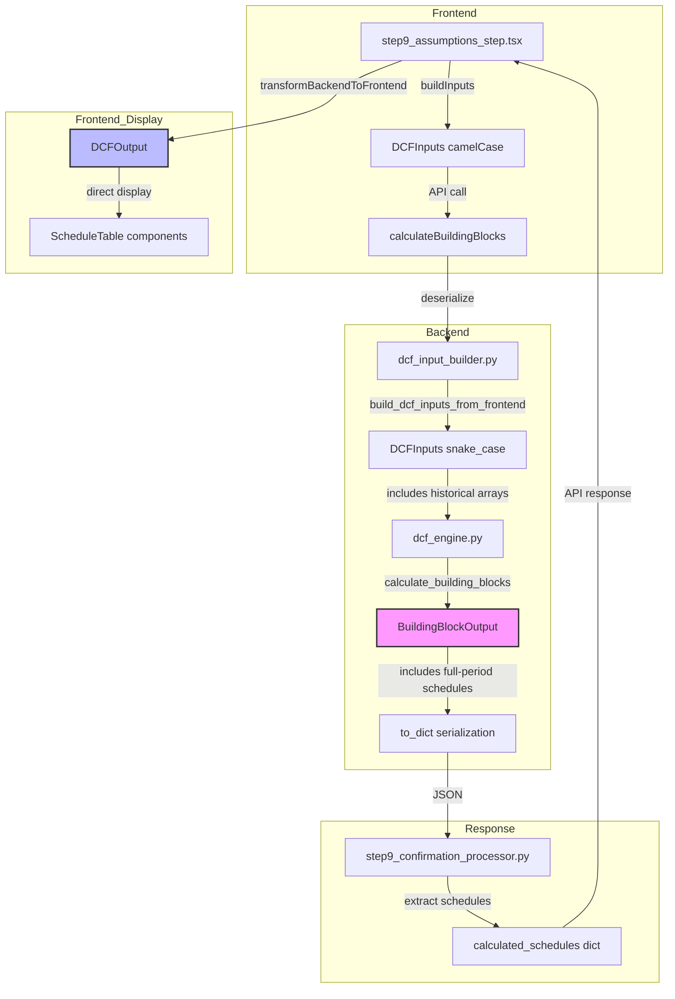
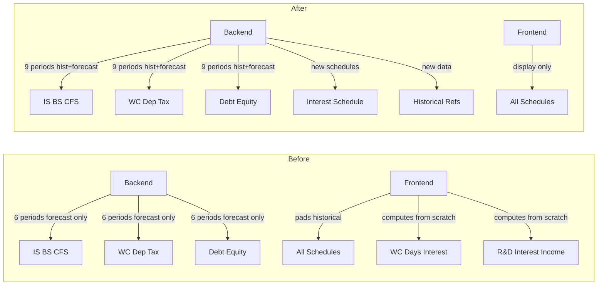

# Plan: Move Frontend-Only Step 9 Calculations to Backend

## Executive Summary

Several Step 9 building block schedules are computed entirely in the frontend (`step9_assumptions_step.tsx`) instead of the backend (`dcf_engine.py`). This includes WC Days, Interest Schedule, and historical reference rows (R&D, Interest Income, Other Income/Expense, Tax Paid, Interest Paid, Share Buybacks). The goal is to move all computation to the backend so the frontend becomes a pure display layer.

## Current State Analysis

### Frontend-Only Calculations Identified

| # | Calculation | Location in step9_assumptions_step.tsx | Description |
|---|-------------|---------------------------------------|-------------|
| 1 | **WC Days** | Lines 1036-1044 | Computes `AR/Rev×365`, `Inv/COGS×365`, `AP/COGS×365` from historical raw data |
| 2 | **Historical NWC** | Lines 1046-1049 | Computes NWC = AR + Inv − AP and Change in NWC from historical data |
| 3 | **Historical CFS Components** | Lines 1053-1075 | Computes `cashFromAr`, `cashFromInv`, `cashFromAp`, CFF from balance sheet deltas |
| 4 | **IS: R&D Expense** | Lines 1470-1480 | Historical from XBRL + forecast = last hist × opex growth |
| 5 | **IS: Interest Income** | Lines 1488-1498 | Historical from XBRL + forecast = Opening Cash × Rate |
| 6 | **IS: Total OpEx** | Lines 1482-1486 | SG&A + R&D + Other OpEx (derived) |
| 7 | **CFS: Historical Reference Rows** | Lines 1700-1729 | Share Buybacks, Debt Issuance/Repayments, Tax Paid, Interest Paid |
| 8 | **Debt Schedule Part 1** | Lines 1803-1867 | LT Debt Balance roll-forward, Opening Cash, Cash Interest Income — historical + forecast |
| 9 | **Debt Schedule Part 2** | Lines 1870-1914 | Revolving Credit, LT Interest, Net Interest Expense — historical + forecast |
| 10 | **Equity Schedule** | Lines 1923+ | Common Equity + Retained Earnings roll — historical + forecast (uses `sharedEquity`) |

### Backend Current State

The backend already computes all forecast-only versions of these schedules:
- `DebtSchedulePart1` (forecast-only, 6 periods)
- `DebtSchedulePart2` (forecast-only, 6 periods)
- `EquitySchedule` (forecast-only, 6 periods)
- `WorkingCapitalSchedule` (forecast-only, 6 periods — already has `ar_days`, `inv_days`, `ap_days`)

**Key gap**: All schedules are forecast-only (6 periods). Historical data exists in `DCFInputs` but is not included in schedule output.

### Data Flow

```
Frontend (step9_assumptions_step.tsx)
  → buildInputs() → DCFInputs (camelCase)
  → calculateBuildingBlocks() API call
  → Backend (dcf_input_builder.py)
    → build_dcf_inputs_from_frontend() → DCFInputs (snake_case)
  → Backend (dcf_engine.py)
    → calculate_building_blocks() → BuildingBlockOutput (forecast-only)
  → Backend (step9_confirmation_processor.py)
    → _extract_building_block_schedules() → Dict
  → Frontend
    → transformBackendToFrontend() → DCFOutput
    → pad() / padWithHistorical() — pads backend arrays with historical data
    → Frontend computes: WC days, Interest Schedule, R&D, Interest Income, etc.
```

---

## Implementation Plan

### Phase 1: Backend — Extend DCFInputs with Additional Historical Fields

**File**: `backend/app/services/international/dcf_engine.py`

Add new fields to `DCFInputs` dataclass for historical data that is currently only available in the frontend:

```python
# Additional historical data (for reference rows in building block output)
historical_interest_income: List[float] = field(default_factory=list)
historical_research_development: List[float] = field(default_factory=list)
historical_other_income_expense: List[float] = field(default_factory=list)
historical_tax_paid: List[float] = field(default_factory=list)
historical_interest_paid: List[float] = field(default_factory=list)
historical_share_buybacks: List[float] = field(default_factory=list)
historical_dividends_paid: List[float] = field(default_factory=list)
historical_debt_issuance: List[float] = field(default_factory=list)
historical_debt_repayments: List[float] = field(default_factory=list)
```

Also add fields for historical balance sheet arrays needed by schedule builders:

```python
# Multi-year historical arrays (for schedule builders)
historical_ar: List[float] = field(default_factory=list)  # Already scalar, change to list
historical_inventory: List[float] = field(default_factory=list)
historical_ap: List[float] = field(default_factory=list)
historical_cash: List[float] = field(default_factory=list)
historical_long_term_debt: List[float] = field(default_factory=list)
historical_total_debt: List[float] = field(default_factory=list)
historical_total_equity: List[float] = field(default_factory=list)
historical_common_equity: List[float] = field(default_factory=list)
historical_retained_earnings: List[float] = field(default_factory=list)
```

**Note**: The existing scalar fields (`historical_ar`, `historical_inventory`, `historical_ap`) will be kept for backward compatibility but the new list versions will be used for schedule building.

### Phase 2: Backend — New Dataclass: HistoricalReferenceRows

**File**: `backend/app/services/international/dcf_engine.py`

Add a new dataclass for historical-only reference data that the frontend currently computes:

```python
@dataclass
class HistoricalReferenceRows:
    """Historical-only reference rows from XBRL data.
    These are display-only rows that appear in building block schedules
    but are not computed by the DCF engine (they come from actual filings)."""
    years: List[str]
    # Income Statement references
    interest_income: List[float]       # From XBRL interest income
    research_development: List[float]  # From XBRL R&D expense
    other_income_expense: List[float]  # From XBRL other income/expense
    # Cash Flow Statement references
    tax_paid: List[float]              # From XBRL tax payments
    interest_paid: List[float]         # From XBRL interest payments
    share_buybacks: List[float]        # From XBRL share repurchases
    debt_issuance: List[float]         # From XBRL debt issuance
    debt_repayments: List[float]       # From XBRL debt repayments
    dividends_paid: List[float]        # From XBRL dividend payments
```

### Phase 3: Backend — Extend WorkingCapitalSchedule with Historical Periods

**File**: `backend/app/services/international/dcf_engine.py`

The existing `WorkingCapitalSchedule` already has `ar_days`, `inv_days`, `ap_days` fields. These are forecast-only. We need to:

1. Add a helper method to compute historical WC days from `DCFInputs`:
   - `AR Days = (historical_ar / historical_revenue) × 365`
   - `Inv Days = (historical_inventory / historical_cogs) × 365`
   - `AP Days = (historical_ap / historical_cogs) × 365`

2. Modify `_build_working_capital_schedule()` to optionally include historical periods.

**Approach**: Instead of modifying the existing method (which is used by forecast-only code paths), add a new method `_build_full_working_capital_schedule()` that:
- Takes historical arrays as additional input
- Computes historical WC balances, days, NWC, and change in NWC
- Prepends historical periods before forecast periods
- Returns a schedule with `years = histPeriods + forecastPeriods`

### Phase 4: Backend — New Method: `_build_interest_schedule()`

**File**: `backend/app/services/international/dcf_engine.py`

Create a new dataclass and builder method that combines the interest-related calculations from both frontend and backend:

```python
@dataclass
class InterestSchedule:
    """Interest Schedule — combines Debt Part 1 & Part 2 interest items
    plus historical reference data. This is the 'Interest Schedule' shown in Step 9."""
    years: List[str]
    # Historical reference (from XBRL)
    lt_interest_historical: List[float]      # Historical interest expense
    total_interest_expense_historical: List[float]  # Historical total interest
    interest_income_historical: List[float]  # Historical interest income
    # Forecast (from engine)
    opening_cash: List[float]                # Opening cash balance
    cash_interest_rate: List[float]          # Cash interest rate (constant)
    cash_interest_income: List[float]        # Opening Cash × Rate
    lt_debt_balance: List[float]             # LT Debt roll-forward
    lt_debt_interest_rate: List[float]       # LT Debt rate (constant)
    lt_debt_interest_expense: List[float]    # LT Debt Balance × Rate
    revolving_credit_balance: List[float]    # Revolver balance
    revolving_credit_rate: List[float]       # Revolver rate (constant)
    revolving_interest_expense: List[float]  # Revolver × Rate
    net_interest_expense: List[float]        # LT Interest − Revolver Interest
    total_interest_expense: List[float]      # LT Interest − Cash Interest Income
```

The builder method `_build_interest_schedule()` will:
1. Use historical data from `DCFInputs` for historical periods
2. Use `DebtSchedulePart1` and `DebtSchedulePart2` for forecast periods
3. Concatenate historical + forecast

### Phase 5: Backend — Extend BuildingBlockOutput

**File**: `backend/app/services/international/dcf_engine.py`

Add new fields to `BuildingBlockOutput`:

```python
@dataclass
class BuildingBlockOutput:
    # ... existing fields ...
    
    # NEW: Full-period schedules (historical + forecast + terminal)
    # These include 3 historical periods + 6 forecast periods = 9+ total
    full_working_capital: Optional[WorkingCapitalSchedule] = None
    interest_schedule: Optional[InterestSchedule] = None
    historical_references: Optional[HistoricalReferenceRows] = None
    
    # Period labels
    historical_years: List[str] = field(default_factory=list)  # e.g., ["2020", "2021", "2022"]
    forecast_years: List[str] = field(default_factory=lambda: ["FY1", "FY2", "FY3", "FY4", "FY5", "Terminal"])
    all_years: List[str] = field(default_factory=list)  # combined
```

Update `to_dict()` to serialize the new fields.
Update `from_dict()` to deserialize them.

### Phase 6: Backend — Update `calculate_building_blocks()`

**File**: `backend/app/services/international/dcf_engine.py`

In `calculate_building_blocks()`, after computing the forecast-only schedules, build the full-period versions:

```python
# After existing schedule builders...

# Build historical reference rows
hist_refs = self._build_historical_references(drivers)

# Build full working capital schedule (historical + forecast)
full_wc = self._build_full_working_capital_schedule(drivers, revenue, cogs)

# Build interest schedule (historical + forecast)
interest_sched = self._build_interest_schedule(cfs, debt_part1, debt_part2)

# Determine period labels
hist_years = self._get_historical_period_labels()
forecast_years = ["FY1", "FY2", "FY3", "FY4", "FY5", "Terminal"]
all_years = hist_years + forecast_years

return BuildingBlockOutput(
    # ... existing fields ...
    full_working_capital=full_wc,
    interest_schedule=interest_sched,
    historical_references=hist_refs,
    historical_years=hist_years,
    forecast_years=forecast_years,
    all_years=all_years,
)
```

### Phase 7: Backend — Update dcf_input_builder.py

**File**: `backend/app/services/international/dcf_input_builder.py`

Ensure the additional historical fields are passed through from the frontend to `DCFInputs`:

In `build_dcf_inputs_from_frontend()`:
```python
# Map additional historical fields from frontend to backend
HISTORICAL_FIELD_MAP = {
    'historicalInterestIncome': 'historical_interest_income',
    'historicalResearchDevelopment': 'historical_research_development',
    'historicalOtherIncomeExpense': 'historical_other_income_expense',
    'historicalTaxPaid': 'historical_tax_paid',
    'historicalInterestPaid': 'historical_interest_paid',
    'historicalShareBuybacks': 'historical_share_buybacks',
    'historicalDividendsPaid': 'historical_dividends_paid',
    'historicalDebtIssuance': 'historical_debt_issuance',
    'historicalDebtRepayments': 'historical_debt_repayments',
    # Multi-year balance sheet arrays
    'historicalCash': 'historical_cash',
    'historicalLongTermDebt': 'historical_long_term_debt',
    'historicalTotalDebt': 'historical_total_debt',
    'historicalTotalEquity': 'historical_total_equity',
    'historicalCommonEquity': 'historical_common_equity',
    'historicalRetainedEarnings': 'historical_retained_earnings',
}
```

### Phase 8: Backend — Update step9_confirmation_processor.py

**File**: `backend/app/services/international/step9_confirmation_processor.py`

Update `_extract_building_block_schedules()` to include the new schedules in the output:

```python
# Add to the return dict:
'interest_schedule': dcf_engine_output.get('interest_schedule', {}),
'historical_references': dcf_engine_output.get('historical_references', {}),
'full_working_capital': dcf_engine_output.get('full_working_capital', {}),
'metadata': {
    'historical_years': dcf_engine_output.get('historical_years', []),
    'forecast_years': dcf_engine_output.get('forecast_years', []),
    'all_years': dcf_engine_output.get('all_years', []),
},
```

### Phase 9: Frontend — Update TypeScript Types

**File**: `frontend/src/utils/dcf_types.ts`

Add new interfaces:

```typescript
export interface InterestSchedule {
  years: string[];
  ltInterestHistorical: number[];
  totalInterestExpenseHistorical: number[];
  interestIncomeHistorical: number[];
  openingCash: number[];
  cashInterestRate: number[];
  cashInterestIncome: number[];
  ltDebtBalance: number[];
  ltDebtInterestRate: number[];
  ltDebtInterestExpense: number[];
  revolvingCreditBalance: number[];
  revolvingCreditRate: number[];
  revolvingInterestExpense: number[];
  netInterestExpense: number[];
  totalInterestExpense: number[];
}

export interface HistoricalReferenceRows {
  years: string[];
  interestIncome: number[];
  researchDevelopment: number[];
  otherIncomeExpense: number[];
  taxPaid: number[];
  interestPaid: number[];
  shareBuybacks: number[];
  debtIssuance: number[];
  debtRepayments: number[];
  dividendsPaid: number[];
}
```

Update `DCFOutput` to include:
```typescript
interestSchedule?: InterestSchedule;
historicalReferences?: HistoricalReferenceRows;
fullWorkingCapital?: WorkingCapital;
```

### Phase 10: Frontend — Update transformBackendToFrontend()

**File**: `frontend/src/components/valuation-flow/step9_assumptions_step.tsx`

Extend the transform function to map the new backend fields:

```typescript
// In transformBackendToFrontend():
const intSched = data?.interest_schedule || {};
const histRefs = data?.historical_references || {};
const fullWc = data?.full_working_capital || {};

// Map interest schedule
interestSchedule: {
  years: intSched.years || [],
  ltInterestHistorical: intSched.lt_interest_historical || [],
  // ... etc
},

// Map historical references
historicalReferences: {
  years: histRefs.years || [],
  interestIncome: histRefs.interest_income || [],
  // ... etc
},

// Use full working capital (historical + forecast) instead of forecast-only
workingCapital: {
  years: fullWc.years || wc.years || years,
  arDays: fullWc.ar_days || wc.ar_days || [],
  // ... etc
},
```

### Phase 11: Frontend — Simplify step9_assumptions_step.tsx

**File**: `frontend/src/components/valuation-flow/step9_assumptions_step.tsx`

Replace frontend computations with backend values:

1. **WC Days** (lines 1036-1044): Remove manual `histARdays`, `histInvdays`, `histAPdays` computation. Use `output.fullWorkingCapital.arDays` directly.

2. **Historical NWC** (lines 1046-1049): Remove. Use `output.fullWorkingCapital.nwc` and `changeInNwc` directly.

3. **CFS Historical Components** (lines 1053-1075): Remove `histCashFromAr`, `histCashFromInv`, `histCashFromAp`. Use backend values.

4. **IS R&D** (lines 1470-1480): Replace with `output.historicalReferences.researchDevelopment` for historical + backend forecast.

5. **IS Interest Income** (lines 1488-1498): Replace with `output.interestSchedule.cashInterestIncome` (full period).

6. **CFS Historical Reference Rows** (lines 1700-1729): Replace with `output.historicalReferences.*` values.

7. **Debt Schedule Part 1** (lines 1803-1867): Replace with `output.interestSchedule.*` values.

8. **Debt Schedule Part 2** (lines 1870-1914): Replace with `output.interestSchedule.*` values.

9. **Equity Schedule** (lines 1923+): The `sharedEquity` computation may need to be updated to use backend equity schedule data where available.

**Important**: The `pad()` and `padWithHistorical()` functions will still be used for schedules that don't yet include historical periods (e.g., IS, BS, Depreciation, Tax). But the schedules listed above will use backend values directly.

### Phase 12: Verify Calculations

Steps to verify:
1. Run the backend with test data and compare output to current frontend calculations
2. Ensure all schedule rows in Step 9 display correctly
3. Check that the "Calculate" button still works (sends overrides, recalculates)
4. Verify that historical period labels are correct
5. Check that the Balance Sheet and other schedules still pad correctly with historical data

---

## Mermaid Diagram: Data Flow After Changes



## Mermaid Diagram: Schedule Coverage Before vs After



## Risk Mitigation

1. **Backward compatibility**: The `full_working_capital`, `interest_schedule`, and `historical_references` fields are optional (defaulting to `None`). If the backend hasn't been updated, the frontend falls back to the old behavior (manual computation).

2. **Gradual migration**: The frontend can be updated schedule-by-schedule. Each schedule can switch from "compute in frontend" to "use backend value" independently.

3. **Testing**: Add unit tests comparing frontend-computed values with backend-computed values for the same inputs to ensure numerical equivalence.

## Files Modified

| File | Changes |
|------|---------|
| `backend/app/services/international/dcf_engine.py` | New dataclasses, extend DCFInputs, new builder methods, extend BuildingBlockOutput |
| `backend/app/services/international/step9_confirmation_processor.py` | Update `_extract_building_block_schedules()` |
| `backend/app/services/international/dcf_input_builder.py` | Pass through additional historical fields |
| `frontend/src/utils/dcf_types.ts` | New interfaces, update DCFOutput |
| `frontend/src/components/valuation-flow/step9_assumptions_step.tsx` | Simplify to use backend values |
