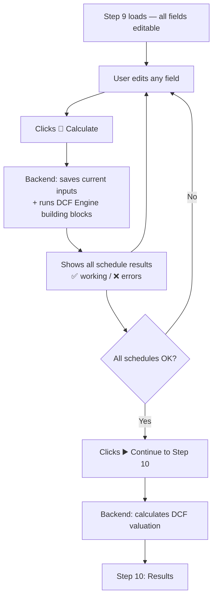

---

## Step 9 Corrected Workflow

> **Last Updated**: 2026-06-14
> **Status**: IN PROGRESS

### The Calculate → Review → Continue Loop



One loop: **edit → calculate → see results → edit again → ... → continue to Step 10**.

### Key Principles

1. **Calculate is always available** — user can click it at any time, with any field values
2. **Calculate temporarily saves inputs** — acts as a working snapshot, not a final confirmation
3. **Partial results shown** — if some schedules fail, show working ones alongside error flags
4. **No auto-advance to Step 10** — only the "Continue to Step 10" button transitions forward
5. **Iterative preview loop** — user edits, calculates, reviews, edits again until all schedules are correct

### The Problem (Before Fix)

```
Step 9: /step-9-calculate-building-blocks requires step9_confirmed_outputs
step9_confirmed_outputs only created by /step-9-confirm-assumptions
→ Circular dependency: must confirm before calculating, but need to calculate to review
```

### The Fix

- Backend: `/step-9-calculate-building-blocks` builds inputs directly from session data (Steps 6/7/8) when `step9_confirmed_outputs` doesn't exist yet
- Frontend: Calculate button always works, shows results with per-schedule success/error status
- Frontend: "Continue to Step 10" is a separate button, only enabled when all schedules pass

---

## 1. The Problem (Original)

### Original (Incorrect) Architecture

```
Step 9: Runs DCFEngine → produces projected schedules → shows in response
Step 10: Runs DCFEngine AGAIN → produces valuation outputs
```

**Why this was wrong:**
1. Step 9 showed **projected schedules** based on assumptions that **haven't been confirmed yet**
2. Step 10 ran the **same calculation again** with the same inputs
3. The projected schedules in Step 9 used **unconfirmed assumptions** — misleading to the user
4. Most projected inputs are **future forecasts** (revenue growth, cost margins, CapEx) — NOT historical data

---

## 2. Correct Architecture (Implemented)

### Step-by-Step Responsibilities

```
Step 8: AI generates initial assumptions
  ↓
Step 9: User reviews and confirms assumption VALUES
  + Runs DCFEngine → produces BUILDING BLOCK schedules
  + Shows projected IS, BS, CFS, WC, Depreciation, Asset, Debt, Equity, Tax schedules
  + Stores full DCFEngine output in session for Step 10 reuse
  ↓
Step 10: Reads stored DCFEngine output from Step 9 (NO re-calculation)
  + Extracts UFCF, DCF, Valuation schedules from stored output
  + Shows football field, sensitivity, scenario analysis, per-share value
```

### Step-by-Step Schedule Split

| Step | Excel Equivalent | Shows | Does NOT Show |
|------|-----------------|-------|---------------|
| **Step 8** | Inputs sheet (initial) | AI-suggested assumption values with historical trendlines | Projected schedules |
| **Step 9** | Inputs sheet (confirmed) + Model sheet (projected statements) | Final assumption values + building block schedules: IS, BS, CFS, WC, Depreciation, Asset, Debt 1&2, Equity, Tax | UFCF, DCF, Valuation |
| **Step 10** | Outputs sheet | UFCF derivation, DCF details (perpetuity + multiple), NPV/XNPV, sensitivity tables, football field, scenario analysis | Building block schedules (already shown in Step 9) |

---

## 3. What Changed

### 3A. Step 9: Runs DCFEngine, Shows Building Block Schedules

**Files changed:**
- [`unified_step_schemas.py`](backend/app/api/schemas/unified_step_schemas.py) — Added `calculated_schedules` field to `UnifiedStep9Response`
- [`step9_confirmation_processor.py`](backend/app/services/international/step9_confirmation_processor.py) — Added `_run_dcf_calculation()` call and `_extract_building_block_schedules()` method
- [`valuation_routes.py`](backend/app/api/routes/valuation_routes.py) — Pass `calculated_schedules` through in Step 9 response

**Rationale:** Step 9 runs the DCF Engine so the user can review the projected financial statements before proceeding. The building block schedules (IS, BS, CFS, etc.) are the "inputs" to UFCF derivation and should be visible for validation.

### 3B. Step 10: Shows UFCF/DCF/Valuation Schedules

**Files changed:**
- [`unified_step_schemas.py`](backend/app/api/schemas/unified_step_schemas.py) — Updated `calculated_schedules` in `UnifiedStep10Response` to contain UFCF/DCF/valuation schedules
- [`valuation_routes.py`](backend/app/api/routes/valuation_routes.py) — Extract only UFCF/DCF/valuation schedules from stored DCFEngine output

**Rationale:** Step 10 shows the "outputs" of the model: how the building blocks combine into UFCF, how UFCF is discounted to enterprise value, and the final per-share valuation.

### 3C. Double Calculation Elimination

Step 9 stores the full DCFEngine output in session (`dcf_engine_output`). Step 10 reads this stored output instead of running DCFEngine again. This eliminates the double calculation that existed before.

---

## 4. Building Block Schedules (Step 9)

These are the projected financial statements shown in Step 9:

```
┌─────────────────────────────────────────────────────────────────┐
│ STEP 9: ASSUMPTION CONFIRMATION + BUILDING BLOCK SCHEDULES      │
│                                                                  │
│ TABS:                                                            │
│ ├── [Income Statement]        ← Revenue, COGS, EBITDA, EBIT    │
│ ├── [Cash Flow Statement]     ← CFO, CFI, CFF, Cash Balance    │
│ ├── [Balance Sheet]           ← Assets = Liabilities + Equity   │
│ ├── [Working Capital]         ← AR/Inv/AP Days + Balances       │
│ ├── [Depreciation]            ← Existing + New Asset cohorts    │
│ ├── [Debt Schedule Part 1]    ← Cash + LT Debt balances         │
│ ├── [Debt Schedule Part 2]    ← Revolving Credit + Net Interest │
│ ├── [Equity Schedule]         ← Common Equity + Retained Earnings│
│ ├── [Tax — Levered]           ← EBT-based with NOL utilization  │
│ ├── [Tax — Unlevered]         ← EBIT-based with NOL utilization │
│ └── [WACC Calculation]        ← Peer betas, Cost of Equity/Debt│
│                                                                  │
│ [✅ Confirm & Run Valuation] → proceeds to Step 10               │
└─────────────────────────────────────────────────────────────────┘
```

---

## 5. UFCF / DCF / Valuation Schedules (Step 10)

These are the "output" schedules shown in Step 10:

```
┌─────────────────────────────────────────────────────────────────┐
│ STEP 10: VALUATION DASHBOARD                                    │
│                                                                  │
│ TABS:                                                            │
│ ├── [UFCF Schedule]           ← EBITDA method: EBITDA - Tax     │
│ │                              ← - CapEx + ΔWC                  │
│ ├── [UFCF 3 Methods]          ← EBIT / NI / EBITDA cross-check │
│ ├── [Intrinsic Extracts]      ← Financial statement extracts    │
│ ├── [DCF — Perpetuity]        ← Discount factors, PV, TV, EV   │
│ ├── [DCF — Multiple]          ← Exit multiple TV, PV, EV       │
│ ├── [NPV / XNPV / IRR]       ← End/mid-period, date-based     │
│ ├── [Sensitivity — Perpetuity]← WACC × Growth heatmap          │
│ ├── [Sensitivity — Multiple]  ← WACC × Multiple heatmap        │
│ └── [Football Field Chart]    ← All methods comparison          │
│                                                                  │
│ KEY METRICS:                                                     │
│ Enterprise Value: $XX,XXX  │  Equity Value: $XX,XXX            │
│ Fair Value/Share: $X.XX    │  Current Price: $X.XX              │
│ Implied Upside: +/-XX%     │  Confidence: High/Medium/Low       │
└─────────────────────────────────────────────────────────────────┘
```

---

## 6. Data Flow Diagram

```
┌──────────┐     ┌──────────┐     ┌──────────┐     ┌──────────┐     ┌──────────┐
│  Step 6  │────▶│  Step 7  │────▶│  Step 8  │────▶│  Step 9  │────▶│  Step 10 │
│  Fetch   │     │  Gap Fill│     │  Merger  │     │  Confirm │     │ Valuate  │
│  from API│     │  + AI    │     │  6 + 7   │     │  + DCF   │     │ UFCF/DCF │
└──────────┘     └──────────┘     └──────────┘     └──────────┘     └──────────┘
                                       │                 │                 │
                                complete_          DCFEngine.run()    Read stored
                                statements         → building        dcf_engine_
                                       │             blocks            output
                                Step 8 stores     Step 9 stores    Step 10 extracts
                                in session         full DCFOutput   UFCF/DCF/valuation
                                                   + building blocks from stored output
                                                   in response
```

---

## 7. What Step 9 Response Contains

```json
{
  "status": "assumptions_confirmed",
  "method": "DCF",
  "market": "international",
  "all_categories_confirmed": true,
  "confirmed_assumptions": { ... },
  "ready_for_valuation": true,
  "validation_errors": [],

  "calculated_schedules": {
    "income_statement": { "years": [...], "revenue": [...], "cogs": [...], ... },
    "cash_flow_statement": { "years": [...], "subtotal_cfo": [...], ... },
    "balance_sheet": { "years": [...], "total_assets": [...], ... },
    "working_capital": { "years": [...], "ar_balance": [...], ... },
    "depreciation": { "years": [...], "capex": [...], ... },
    "tax_levered": { "years": [...], "current_tax": [...], ... },
    "tax_unlevered": { "years": [...], "current_tax": [...] },
    "wacc_calculation": { "wacc": 0.08, ... }
  }
}
```

---

## 8. What Step 10 Response Contains

```json
{
  "status": "success",
  "method": "DCF",
  "market": "international",
  "ticker": "AAPL",
  
  "valuation_summary": {
    "enterprise_value": {"value": 101733, "unit": "USD"},
    "equity_value": {"value": 83075, "unit": "USD"},
    "fair_value_per_share": {"value": 2.43, "unit": "USD"},
    "current_price": {"value": 2.23, "unit": "USD"},
    "implied_upside_downside": {"value": 0.0896, "unit": "percentage"}
  },
  
  "calculated_schedules": {
    "ufcf": { "years": [...], "ebitda": [...], "current_tax_unlevered": [...], "ufcf": [...] },
    "ufcf_3_methods": { "ebit_method": [...], "net_income_method": [...], "ebitda_method": [...] },
    "intrinsic_extracts": { "years": [...], ... },
    "dcf_details": {
      "perpetuity_method": { "discount_factors": [...], "pv_discrete_cf": [...], "terminal_value": ..., "enterprise_value": ... },
      "exit_multiple_method": { ... }
    },
    "npv_xnpv": { "npv_end_of_period": ..., "xnpv_end_of_period": ..., ... },
    "sensitivity_perpetuity": { "0.08": { "0.02": 83075, ... }, ... },
    "sensitivity_multiple": { "0.08": { "7.0": 92000, ... }, ... },
    "main_outputs": { "perpetuity_method": {...}, "exit_multiple_method": {...} },
    "wacc_calculation": { "wacc": 0.08, ... }
  },
  
  "sensitivity_analysis": { ... },
  "scenario_analysis": { "Bull Case": {...}, "Bear Case": {...} },
  "confidence_level": "high",
  "warnings": []
}
```

---

## 9. Risk Assessment

| Risk | Impact | Mitigation |
|------|--------|-----------|
| Step 9 response becomes larger (includes building block schedules) | Performance | Schedules are computed server-side; JSON typically <500KB for building blocks only |
| Step 9 takes longer (runs DCFEngine) | UX | Add loading indicator; DCFEngine calculation is ~100ms |
| User wants to change assumptions after seeing building blocks | UX | "Back to Assumptions" button available in Step 9 |
| Step 10 still runs DCFEngine (for scenario analysis) | Performance | Step 10 reads stored base_case output; only re-runs for Bull/Bear scenarios (~200ms extra) |
| Vietnamese market doesn't have full DCFEngine schedules | Compatibility | VN uses separate `vn_step10_valuation_processor` — not affected |
| DuPont and Comps don't have projected schedules | Method difference | Only DCF has building block schedules; DuPont/Comps skip Step 9 schedules |

---

## 10. Implementation Checklist

- [x] `unified_step_schemas.py` — Add `calculated_schedules` to `UnifiedStep9Response`
- [x] `step9_confirmation_processor.py` — Add `_run_dcf_calculation()` + `_extract_building_block_schedules()`
- [x] `valuation_routes.py` — Pass building block schedules in Step 9 response
- [x] `valuation_routes.py` — Store `dcf_engine_output` in session for Step 10
- [x] `valuation_routes.py` — Extract UFCF/DCF/valuation schedules in Step 10 response
- [ ] Frontend `AssumptionsStep.tsx` / `RunValuationStep.tsx` — Add tabs for building block schedules in Step 9
- [ ] Frontend — Add tabs for UFCF/DCF/valuation schedules in Step 10
- [ ] Update `step9-stored-inputs-map.md` — Document new session structure
- [ ] Test end-to-end flow with backend
